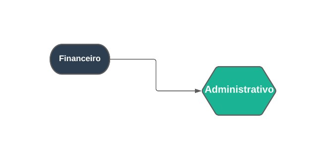

## Administrativo
***
 

##### **Definições**

O módulo Administrativo, é um módulo para a administração do myphotos e permite cadastrar perfis
de usuários para poderem gerenciar certos campos do myphotos, além da opção de relatório geral sobre o myphotos

O Administrativo está ligado diretamente com o financeiro

##### **Características**

* Permite cadastrar novos perfis para usuários
* Permite gestar todos os usuários cadastrados
* Permite ter uma análise geral sobre o myphotos

##### **Visão Geral**

Neste Modulo tem o objetivo de cadastrar um usuário novo, estes usuários têm  seu próprio cargo,
estes usuários trabalharam em seu devido cargo como na área do estoque, financeiro, contratos, etc.

Também você pode cadastrar uma nova pessoa para cadastrar um perfil de usuário, basta apenas
preencher todas as informações

Já no dashboard você pode ter um relatório geral sobre informações do myphotos, como contratos
que foram realizados e o que não foram realizados, além de relatórios sobre despesas e lucros

