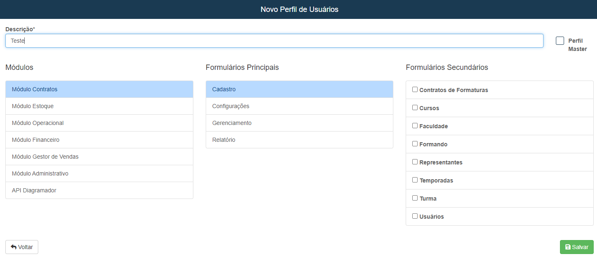

# Perfil de Usuário
**Campo com a função de cadastrar novos perfis de usuário**
***

### Novo Perfil

* `Descrição` - Insira um nome
* **Este campo tem a função de cadastrar perfis para usuário, no caso cadastrar em qual local certo usuário trabalhará**

***
1. Modulos
    - **Contrato**
    - **Estoque**
    - **Operacional**
    - **Financeiro**
    - **Gestor de Vendas**
    - **Administrativo**
***

* **Após escolher um modulo outras opções devem ser escolhida**
***

1. Formularios Principais
    - **Cadastro**
    - **Configuração**
    - **Gerenciamento**
    - **Relatório**
2. Formularios Extras
    - **Alguns modulos tem opções extras**
    - Finaceiro
        - **Cobrança**
        - **Conciliação**
        - **Movimento**
    - Administrativo
        - **Dashboard**

***
## Formularios Segundarios
* **Todos os formularios principais tem formularios secundários e pelo menos um deve ser escolhido**

## Contrato
***
 

1. Contrato - Cadastro
    - **Contratos de Formaturas**
    - **Cursos**
    - **Faculdade**
    - **Formando**
    - **Representantes**
    - **Temporadas**
    - **Turma**
    - **Usuários**
2. Contrato - Gerenciamento
    - **Avaliação de Proposta Contratual**
    - **Clausualas Contratuais**
    - **Formando Comercial**
    - **Produto**
    - **Proposta Comercial**
    - **Turma comercial**
3. Contrato - Relatório
    - **Consulta Geral de Formandos**
    - **Programação de Pagamentos**
    - **Relatório de Custo de Comandos**

## Estoque
***
 

1. Estoque - Cadastro
    - **Categoria**
    - **Fornecedores**
    - **Locais de Estoque**
    - **Pedidos**
    - **Produto**
    - **Produto Item**
    - **Saída de Produtos**
    - **Serviços**
    - **Tipos de Produtos**
    - **Transferência de Produtos**
2. Estoque - Gerenciamento
    - **Gestão de Produtos**
    - **Ordem de Movimento** 
    - **Ordem de Movimento Avançada**
    - **Planilha de Produtos**
3. Estoque - Relatório 
    - **Relatório de Produtos**

## Operacional
***
 

1. Operacional - Cadastro
    - **Acessória do Profissional**
    - **Anotação do Evento**
    - **Caracteristaca do Evento**
    - **Despesas**
    - **Evento Base**
    - **Formandos do Evento**
    - **Objetos de Cobertura**
    - **Profissionais**
    - **Profissionais Funcionários**
    - **Tabela de Valores**
    - **Tipo de Custo**
2. Operacional - Gerenciamento 
    - **Brindes de Evento**
    - **Eventos**
    - **Execução de Contratos**
    - **Planejamento de Reportagem**
    - **Relatório de Reportagem Externo**
    - **Reportagem**
    - **Reportagem Externa**
3. Operacional - Relatório
    - **Calendario de Eventos Google**
    - **Calendario de Eventos Interno**
    - **Programação de Pagamentos**
    - **Relatório de Reportagem**

## Gestor de Vendas
***
 

1. Gestor - Cadastro
    - **Condições para Venda**
    - **Configuração de Escala de Vendas**
    - **Desconto Especiais**
    - **Formas de Pagamentos**
    - **Produtos para Venda**
    - **Tabela de Comissões**
    - **Vendedores**
    - **Vendedores Funcionarios**
2. Gestor - Gerenciamento
    - **Comissão dos Vendores**
    - **Comissões de Vendedores Geral**
    - **Conferência de Retorno**
    - **Escala de Vendedores**
    - **Mapas de Venda**
    - **Pedidos Extras**
    - **Tabela de Vendas**
    - **Venda Nova Visita**
3. Gestor - Relatório
    - **Análise de Vendas**
    - **Conta Correte Vendedor**
    - **Listagem de Vendas**
    - **Pedidos Extras**
    - **Relatório de Feedbacks**
    - **Relatório de Produtos**

## Administração
***
 

1. Administração - Cadastro
    - **Perfil de Usuário**
2. Administração - Configuração
    - **Empresa**
3. Administração - Dashboard
    - **Relatório Gera**
4. Administração - Relatório
    - **Acessos**
    - **Busca Geral de Formandos**

## Financeiro
***
 

1. Financeiro - Cadastro
    - **Beneficiários**
    - **Carteiras**
    - **Centro de Custo X Area de Atuação**
    - **Centro de Custo**
    - **Cliente**
    - **Contas Bancárias de Fornecedores**
    - **Formas de Pagamento**
    - **Fonecedor**
    - **Plano de Contas**
    - **Taxa de Cartões**
2. Financeiro - Cobrança
    - **Ambiente do Cobrador**
    - **Clientes para Cobrança**
    - **Detalhes Renegociação**
    - **Relatório de Cobranças**
3. Financeiro - Conciliação
    - **Coferencia de Extrato Bancário**
4. Financeiro - Movimento
    - **Cheques**
    - **Cobrança Bancária**
    - **Contas a Pagar**
    - **Contas a Receber**
    - **Folha de Pagamento**
    - **Movimento Financeiro**
    - **Plataformas de Cartões**
    - **Programação de Pagamento**
    - **Receber Conta**
    - **Transação**
5. Financeiro - Relatório
    - **Demonstrativo Plano Contas**
    - **Provisionamneto Financeiro**
    - **Relatório Conta Corrente**
    - **Relatório de Fluxo de Recebimento de Cheque**
    - **Relatório Recebimentos**
    - **Saldo em Carteiras**

