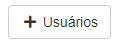
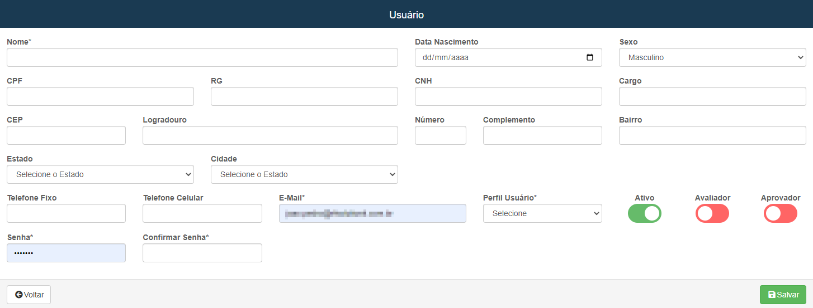

# Usuário
**Campo com a função de cadastrar novos usuários no sistema**
***
### Novo Usuário

#### **Campos para preencher**:

* `Nome` - Insira o nome do usuário a ser cadastrado
* `Data de Nascimento` - Informe a data de nascimento do usuário
* `Sexo` - Informe o sexo do usuário
* `CPF` - Insira o numero do CPF do usuario
* `RG` - Insira o numerio do RG do novo usuário
* `CNH` - Informe a CNH do usuario
* `Cargo` - Informe o cargo do usuario
***
1. Endereço
    - `CEP` - Informe o CEP do usuário
    - `Logradouro` - Insira o nome da rua de moradia do usuário
    - `Numero` - Insira o numero da casa ou do apartamento do usuário
    - `Complemento` - Informe um complemento para facilitar a localização do usuario
    - `Bairro` - Informe o nome do Bairro de moradia do usuário
    - `Estado` - Selecione o Estado
    - `Cidade` - Selecione a cidade
2. Informações extras
    - `Telefone Fixo` - Informe o telefone fixo do usuario
    - `Telefone Celular` - Informe o telefone celular
    - `E-mail` - Informe o E-mail do usuário
    - `Perfil Usuario` - Selecione o perfil de usuário já cadastrado
    - `Senha` - Informe a senha do usuário
    - `Confirmar Senha` - Confirme a senha do usuário

