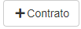
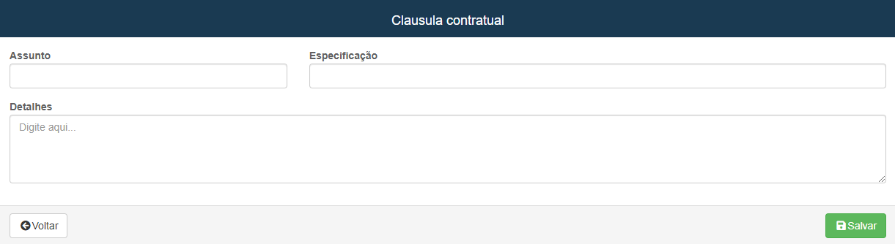
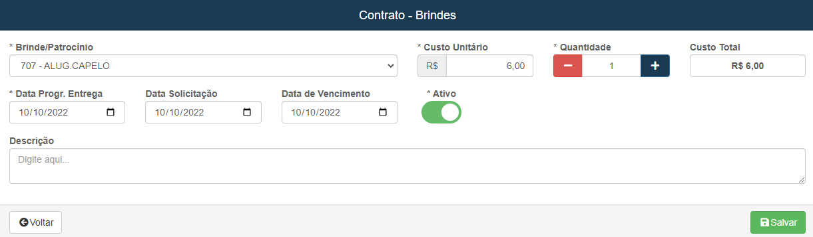

# Cadastro de Formaturas
**Campo para cadastrar novos contratos de formatura**
***
### Nova formatura

#### **Campos para cadastro**:

* `Id Interno` - Id para localização no sistema
* `Estado` - Selecione o estado onde ocorrerá a formatura
* `Cidade` - Selecione a cidade onde acontecerá a formatura 
* `Situação` - Informe a situação de como anda a formatura| **Aprovado, Aguardando aprovação, etc.**
* `Orçamento Estimado` - Insira o gasto estimado para a formatura
* `Padrão` - Importância do evento para a empresa
* `Comarca` - Insira a comarca do local onde ocorrerá
* `Temporada` - Informe em qual temporada acontecerá o evento
* `Representante` Escolha o representante do evento
* `Centro de Custo` - Selecione o centro de custo do evento
* `Data da Assinatura` - Insira a data de início da assinatura
* `Data de previsão de execução` - Insira a data planejada para a execução do evento
* `Data de previsão de venda` - Insira a data de previsão para vendas de produtos
* `Cerimonial` - Escolha o fornecedor para o evento
 

 

##### **Campos opcionais**:

* `Fotos` - Caso for produzir as fotos para o evento ative a opção
* `Vídeos` - Caso for produzir vídeos para o evento ative a opção
* `Organização` - Caso outra empresa organize a formatura deixe a opção desativada
 

***
* **Logo após o salvamento do cadastro, aparecerá uma nova Aba com os campos turmas, produtos de vendas, clausulas contratuais, custos e brindes, anexos**

## Turmas

**Campo com a função de gerenciar e cadastrar turmas que irão participar da formatura**
***

### Cadastra nova turma

 

#### **Campos para preencher**:

* `Instituição` - Insira o nome da faculdade da turma
* `Nome do Curso` - Insira o nome do curso dos formandos
* `Cursos` - Selecione um curso já cadastrado 
* `Número da Turma` - Insira o número da turma
* `Nome da turma` - Insira o nome da turma
* `Turno` - Insira o turno de aula dos formandos
* `Cor do Canudo` - Descreva a cor do canudo
* `Cor da Faixa` - Descreva a cor da faixa
* `Contato` - Insira um método de contato
* `Formandos Informados` - Insira o número de formandos informados
 

***
## Adicionar formandos
* **Logo após a criação de turmas, entre em editar para adicionar a lista de formandos**
 

***

### Cadastrar Formandos

#### **Campos para preencher**

* `Contrato` - Informe o contrato
* `Nome Formando` - Insira o nome do formando
* `E-mail` - Insira o E-mail para contato
* `Estado` - Escolha o estado do formando
* `Cidade` - Insira a cidade do formando
 
**Está é uma opção para facilitar o cadastrado do formando**

***
## Cadastrar Formandos

#### **Campos para cadastro**:
1. **Dados do formando**
    * `Contrato` - Informe o contrato
    * `Nome` - Insira o nome do formando
    * `Comissão`- Escolha uma comissão para o formando
    * `Curso` - Curso do formando
    * `CPF` - Insira o CPF da pessoa
    * `RG` - Informe o RG do formando
    * `Org. Emissor` - Informe o órgão emissor do RG
    * `UF.` - Insira a unidade federativa do formando
    * `Data de Nascimento` - Insira a data do formando a ser cadastrado
    * `Sexo` - Informe o sexo do informando
    * `Portador de Necessidade Especiais` - Descreva se o formando precisa de atendimentos especiais 
    * `Naturalidade` - Informe a naturalidade do formando
    * `Identificação` - Informe se o formando estará presente na formatura
    * `CEP` - Informe o CEP do formando
    * `Logradouro` - Insira a rua do formando
    * `Número` - Informe o número da casa ou apartamento do formando
    * `Complemento` - Descreva um complemento para facilitar a localização
    * `Bairro` - Insira o nome do bairro
    * `Estado` - Informe o estado do formando
    * `Cidade` - Informe a cidade do formando
    * `Telefone Fixo` - Insira o telefone fixo para contato| **Campo não obrigatório**
    * `Telefone Celular` - Informe um telefone celular para contato| **Campo obrigatório**
    * `E-mail` - Insira um E-mail para contato com o formando
    * `Ponto de Referência` - Descreva um ponto de referência para o formando
     
     

    

2. **Dados do Trabalho**
    - Caso o formando tenha algum trabalho deve-se informar
    - `Não Trabalho` - Assinale a opção caso o formando seja desempregado
    - `Empresa` - Insira o nome da empresa
    - `Cargo` - Informe o cargo do formando na empresa
    * `CEP` - Insira o CEP de localização da empresa em que o formando trabalha
    * `Logradouro` - Insira a rua de localização da empresa
    * `Número` - Informe o número de localização da empresa
    * `Complemento` - Descreva um complemento para facilitar a localização
    * `Bairro` - Informe o bairro onde se está localizada a empresa
    * `Estado` - Estado de localização da empresa
    * `Cidade` - Cidade de localização da empresa
     
     

    

3. **Dados dos Familiares**
    - Deve-se cadastrados dados de familiares
    * `Grau de parentesco` - Informe o grau de parentesco do familiar que deseja cadastrar
    * `Nome` - Insira o nome da pessoa
    * `CPF` - Insira o CPF da pessoa
    * `CEP` - Insira o CEP da pessoa
    * `Logradouro` - Insira a rua da pessoa
    * `Número` - Informe o número da casa ou apartamento da pessoa que deseja cadastrar
    * `Complemento` - Informe um complemento para facilitar a localização
    * `Bairro` - Insira o nome do bairro de moradia da pessoa
    * `Estado` - Insira o estado da pessoa
    * `Cidade`- Insira a cidade da pessoa
    * `Telefone Fixo` - Insira um telefone fixo para contato com a pessoa
    * `Telefone Celular` - Insira um telefone celular para contato com a pessoa
     
     

***
## Produtos de vendas
**Campo com a função de cadastrar produtos para vendas**
***

### Novo Produto

#### **Campos para cadastro**:

* `Produto` - Escolha um produto já cadastrado
* `Valor Contratado` - Insira um valor para o produto
* `Quantidade mínima` - Insira uma quantidade mínima para o produto a ser vendido
* `Índice de Reajuste` - Selecione um índice de reajuste para o produto

***

## Clausulas contratuais
**Campo com a função de criar clausulas contratuais**
***
### Nova Clausula

#### **Campos**

* `Assunto` - Descreva o assunto da cláusula
* `Especificação` - Insira uma especificação para o contrato
 

***

## Custos / Brindes
**Campo com a função de cadastrar brindes para a formatura**
***

### Cadastrar Brindes

#### **Campos que devem ser preenchidos**:

* `Brinde ou Patrocínio` - Escolha um brinde ou patrocínio já cadastrado
* `Custo Unitário` - Valor já definido do produto
* `Quantidade` - Insira a quantidade de produtos
* `Data Programada Para Entrega` - Insira uma data para a entrega dos brindes
* `Data Solicitação` - Escolha uma data para realizar o pedido dos produtos
* `Data de Vencimento` - Data de vencimento
* `Custo Total` - Valor total a ser gasto
 

***
## Formaturas já Cadastradas
***
 

### Filtro de Pesquisa

#### **Campos para preencher**:

* `Temporada` - Temporada que ocorrerá evento que procura
* `Representante` - Representante do evento que procura
* `Estado` - Estado onde acontecerá a formatura que procura
* `Cidade` - Cidade onde acontecerá a formatura que procura
* `Situação` - Situação de como está o evento que procura
* `Data inicial da execução` - Dia da execução do evento
* `Data final da execução` - Dia da final do evento
* `Data de início da assinatura` - Data para o início da assinatura 
* `Data de término da assinatura` - Data para o fim da assinatura
* `Padrão` - Importância do evento para a empresa
 

