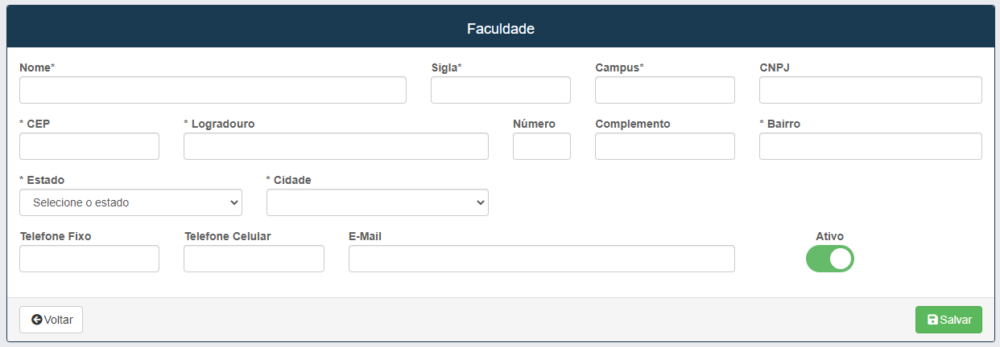

# Faculdades
**Campos com a Função de cadastrar a faculdade dos formandos**

***
### Cadastrar nova Faculdade

#### **Campos para cadastro**:

* `Nome` - Insira o Nome da faculdade
* `Sigla` - Insira a Sigla da faculdade
* `Campus` - Insira o Campus dos alunos formantes
* `CNPJ` - Insira o CNPJ da faculdade
* `CEP` - Insira o CEP da faculdade
* `Logradouro` - Insira a rua da faculdade que deseja cadastrar
* `Número` - Insira o número da faculdade
* `Complemento` - Descreva um complemento para a localização da faculdade
* `Bairro` - Insira o nome do bairro onde a faculdade se está localizada
* `Estado` - Insira o nome do estado onde se está localizada
* `Cidade` -  Insira o nome da cidade que a faculdade se localiza
* `Telefone fixo` - Insira o telefone fixo para contato com a faculdade
* `Telefone celular` - Insira telefone celular para contato
* `E-mail` - Insira o E-mail para contato

