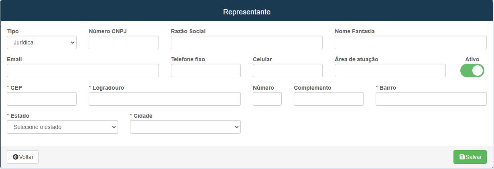

# Representantes
**Campo para inserir um novo representante para um contrato**
***

### Novo Representante

#### **Campos para Cadastro**:
 

* `tipo` - Tipo Jurídica ou Física do representante
* `E-mail` - Insira E-mail para contato
* `Telefone Fixo` - Insira o telefone fixo para contato| Campo Não obrigatório
* `Celular` - Insira o telefone celular para contato| Campo obrigatório
* `Areá de atuação` - Descreva a área de atuação do representante
* `CEP` - Insira CEP de moradia do representante
* `Logradouro` - Insira a sua rua 
* `Número` - Insira o número de casa ou apartamento
* `Complemento` - Descreva um complemento para localização
* `Bairro` - Insira o bairro onde mora
* `Estado` - Insira o estado do representante 
* `Cidade` - Insira a cidade onde se está morando

***
1. **Tipo Jurídica**:
    - `Número CNPJ` - Insira o CNPJ do representante
    - `Razão Social` - Insira a razão social/ nome do estabelecimento
    - `Nome Fantasia` - Insira o nome fantasia do estabelecimento

2. **Tipo Físico**:
    - `Número CPF` - Insira o CPF do representante
    - `Nome` - Insira o nome do representante
 

