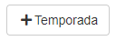
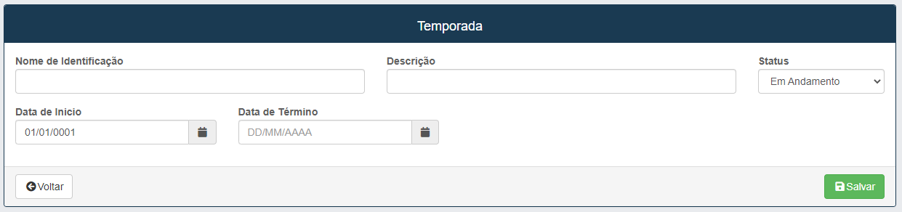
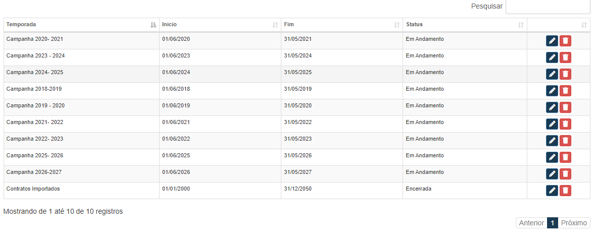
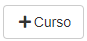
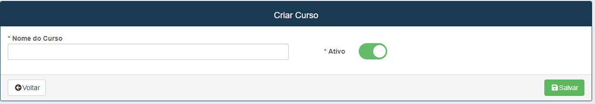
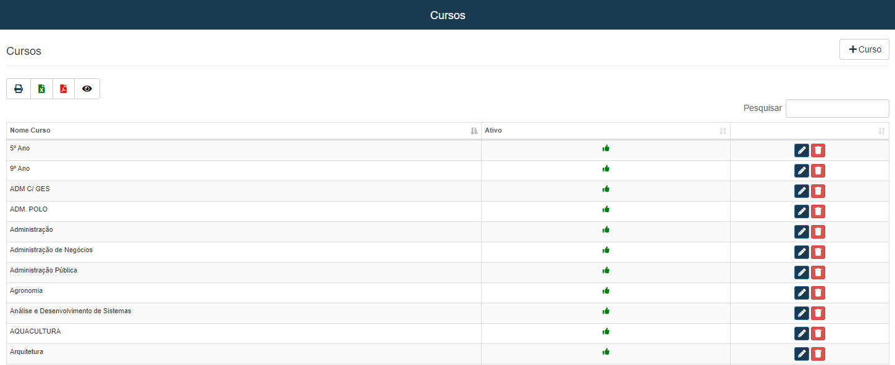

# Temporadas
**Esse campo tem como o objetivo de cadastrar uma nova data de temporada para o ocorrimento de um contrato.**
***
### Nova Temporada

#### **Campos para cadastro**:

* `Nome De identificação` - Insira o nome do contrato para  ser identificada. 
* `Descrição` - De a Descrição da temporada.
* `Status` - Descreva qual seria o status da temporada.
* `Data de inicio` - Insira a data inicial da temporada que deseja cadastrar.
* `Data de término` - Insira a data de término da temporada que deseja cadastrar.

**Todos os campos devem ser preenchidos corretamente**

***

### **Listagem de temporadas**:

***
## **Cursos**
**Campo com a função de cadastrar cursos de faculdades ou etapas escolares para a ocorrência de contratos**
***

### Novo curso

#### **Campo Unico**:

* `Nome do curso` - Insira o nome do curso que deseja cadastrar
* `Ativo` - Informe se o curso ainda está ativo

***

### **Exemplo de listagem de cursos :**

