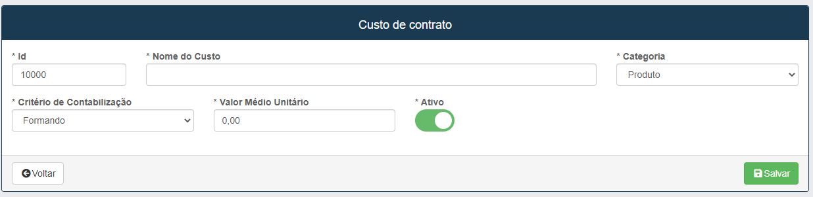
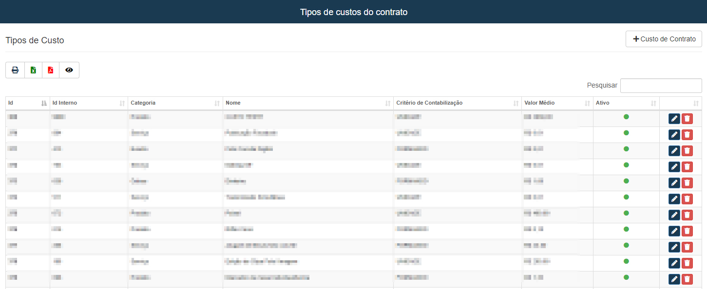

# Tipos de custos
**Campo com a função de cadastrar tipos de custos para contratos**
***
### Cadastrar custo de contrato

#### **Campos para preencher**:

* `Id` - Insira o Id do custo a ser cadastrado.
* `Nome do Custo` - Insira um nome para a identificação do custo 
* `Categoria` - Escolha o Tipo de categoria| **Produto, Serviço, Evento, etc.**
* `Critério de Contabilização` - Selecione a forma de critério de contabilização| **Unidade ou Formando**
* `Valor médio Unitário` - Insira valor médio a ser pago por unidade

***

### Listagem de custos

