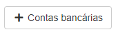

# Fornecedores 
**Campo com a função de gerenciar e principalmente cadastrar novos fornecedores**

### Novo Fornecedor

**OBS: Fornecedores são a mesmo que representantes, profissionais, vendedores e etc...**
#### **Campos para cadastro**
* `CPF/CNPJ` - Selecione **CPF** ou **CNPJ**
* `Centro Custo` - Selecione um centro de custo
* `E-mail` - Insira um E-mail para contato| **Campo Obrigatório**
* `E-mail Alternativo` - Insira um E-mail para contato| **Campo não Obrigatório**
* `Telefone` - Informe um telefone para contato| **Campo Opcional**
* `Celular / Outro` - Informe um telefone celular para contato| **Campo Opcional**
* `Nome Contato` - Insira um nome para contato
* `Área de Atuação` - Informe a Área de atuação do fornecedor
* `Reduzidas` - Selecione uma reduzida já cadastrada
* `Padrão` - Função para se tornar vendedor ou fornecedor padrão
***
1. **CNPJ**
    - `Numero` - Insira o numero do CNPJ do fornecedor
    - `Razão Social` - Nome social da empresa do fornecedor
    - `Nome Fantasia` - Nome fantasia da empresa| **Nome de fachada**
    - `IE` - Insira o IE do fornecedor
2. **CPF** 
    - `Numero` - Insira o numero do CPF do fornecedor
    - `Nome Completo` - Informe o nome completo do fornecedor
    - `Apelido` - Insira o apelido para encontrar o fornecedor
    - `RG` - Insira o RG do fornecedor
    - `Data Nascimento` - Insira a data de nascimento do fornecedor
3. **Endereço**
    - `CEP` - Informe o CEP do fornecedor
    - `Logradouro` - Insira o nome da rua
    - `Numero` - Insira o numero da casa ou do apartamento para localização
    - `Complemento` - Informe um complemento para facilitar a localização
    - `Bairro` - Insira o nome do bairro
    - `Estado` - Insira o estado
    - `Cidade` - Selecione a cidade de residencia do fornecedor
 
 

***

***
 
 

## Editar Fornecedor
**Opção com a função de editar dados do fornecedor**
***

* **Descendo a pagina deparar-se com uma área que posibilita gerenciar caracteristicas e o histórico do fornecedor**

***
### Caracteristica
**Campo com a função de gerenciar e casdastrar caracteriticas de um produtos**
***

* `Descrição` - De uma descrição
* `Tipo` - Selecione um tipo| **Produto, Serviço ou Outros**
* `Quantidade` - Informe a quantidade
* `Valor` - Informe um valor
 

***
### Histórico
**Tabela com a função de exibir gastos**
***

***
### Extrato C/C

* **Campo com a função de gerenciar gastos e ganhos de clientes, fornecedores e etc**

#### **Campos de Pesquisa**

* `Data Ocorrência Inicial` - Insira uma data mínima para a ocorrência
* `Data Ocorrência Final` - Insira uma data máxima de ocorrência
* `Data Efetivaçao Inicial` - Informe uma data miníma de efetivação
* `Data Efetivação Final` - Selecione uma data máxima de efeticação

#### **Inserir Gastos ou Receitas**

##### **Campos para preencher**

* `Descrição` - Dê uma descrição
* `Valor` - Insira um valor para ser lançado
* `Data Efetivação` - Informe a data de efetivação
* `Operação` - Selecione o tipo de operação| **Débito ou Crédito**
* `Conta Contabíl` - Insira o tipo de gasto da conta que será lançada
* `Centro de Custo` - Informe o tipo de centro de custo
* `Área de Atuação` - Insira a área de atuação| **Fornecedor, Vendedor, Profissional e etc..**
***
1. Inserir Movimento 
    - `Carteira` - Selecione uma carteira cadastrada
    - `Forma de Pagamento` - Informe o meio de pagamento| **Moeda, Cheque, Boleto e etc...**

***
 
 

## Cadastro conta bancária
**Opção para cadastrar uma conta bancária**
***

 
 

### Cadastra Conta

#### **Campos para cadastro**:

* `Banco` - Selecione o banco do fornecedor
* `Tipo Documento` - Informe o tipo do documento do fornecedor
* `Numero Documento do Titular` - Insira o numero do documento do fornecedor
* `Nome do Titular` - Insira o nome titular do fornecedor
* `Numero da agência` - Insira o numero da agência do bando do fornecedor
* `DV ag` - Insira o digito verificador da agência
* `Operação` - Informe a operação da conta
* `Numero da Conta` - Insira o numero da conta do fornecedor
* `DV ct.` - Insira o digito verificador da conta
* `Tipo Titular` - Selecione o tipo do titular| **Principal, Salario, Pendências e Outros**
* `Tipo Conta` - Selecione o tipo da conta| **Conta Corrente, Poupança e PIX**
* `Conta preferencial` - Caso for uma conta preferencial ative a opção| **Está opção te dá preferencia na hora do pagamento**

***
### Gerenciar contas
**A função deste campo é gerenciar e editar contas bancárias do fornecedor**
 

