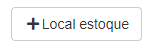
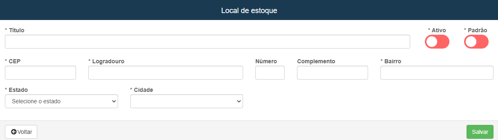
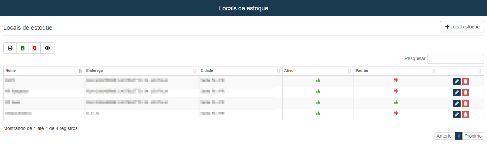

# Locais de Estoque
**Campo com a função de cadastrar e gerenciar estoques para produtos**

### Novo Local para estoque

#### **Campos para cadastro**:

* `Titulo` - Insira um titulo para o local
* `CEP` - Informe o CEP do local
* `Logradouro` - Insira o nome da rua onde se localiza o local de estoque
* `Numero` - Insira o numero de localização do local
* `Complemento` - Informe um complemento para facilitar a localização
* `Bairro` - Insira o nome do bairro
* `Estado` - Selecione o estado onde se localiza o estoque
* `Cidade` - Insira o nome da cidade onde está o estoque
* `Padrão` - Ative a opção caso queira que seja um estoque padrão
 

***
 

### **Listagem dos locais de estoque:**
 

***