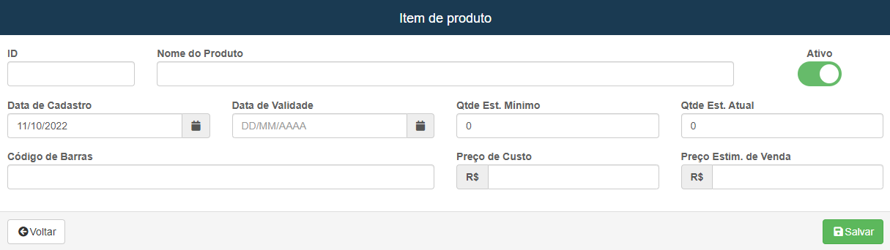
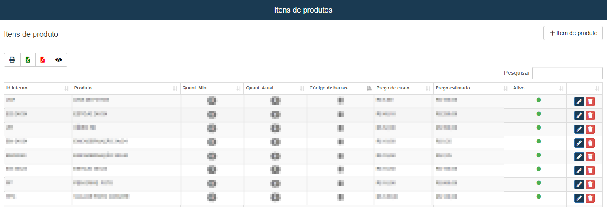

# Itens de produtos
**Campo com a função de gerenciar e cadastrar Itens de produtos**
***
### Novo Item

#### **Campos para preencher**

* `ID` - Insira o ID para o item
* `Nome do Produto` - Insira um nome para o produto
* `Data de cadastro` - Informe a data de cadastro do item
* `Data de Validade` - Informe a data de validade do produto
* `Quantidade Estimada Mínima` - Insira uma quantidade estimada minima de produtos
* `Quantidade Estimada Atual` - Insira uma quantidade estimada atual dos produtos
* `Codigo de Barras` - Informe o codigo de barra do produto
* `Preço de Custo` - Informe o preço de produção do produto
* `Preço Estimado de Venda` - Insira um preço estimado para venda

***
 

### **Listagem dos Item:**
 

***
