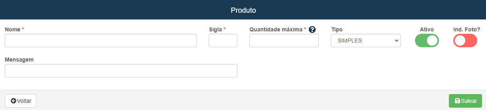
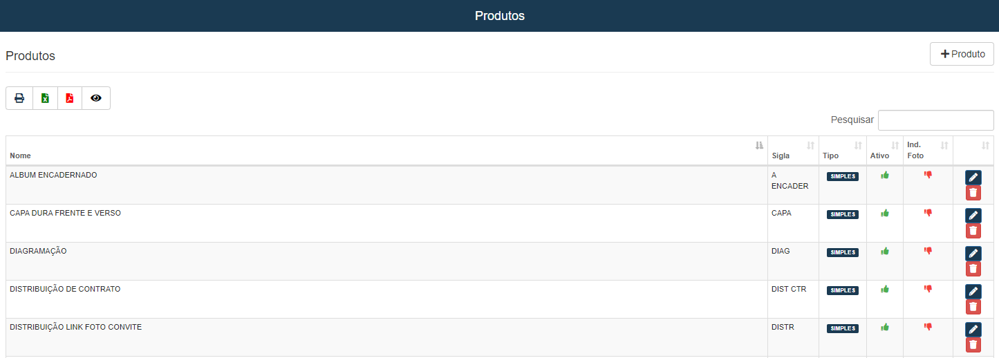

# Produtos
**Campo com a função de gerenciar e cadastrar novos produtos**
***

### Novo Produto

#### **Campos para cadastro**:

* `Nome` - Insira um nome para o produto
* `Sigla` - Insira uma sigla para o produto
* `Quantidade Máxima` - Informe uma quantidade máxima para o produto
* `Tipo` - Selecione o tipo do produto| **Simples ou Composto**
* `Mensagem` - Descreva o produto
* `Ind. Foto?` - Contém fotos?

* **Produtos compostos, são constituídos por mais de um item**

***
 

### **Listagem de produtos cadastrados:**
 

***