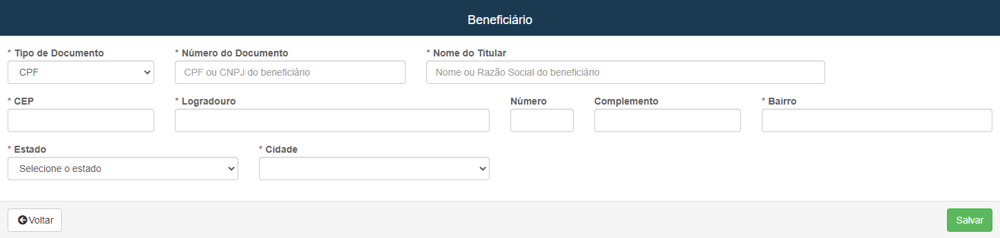
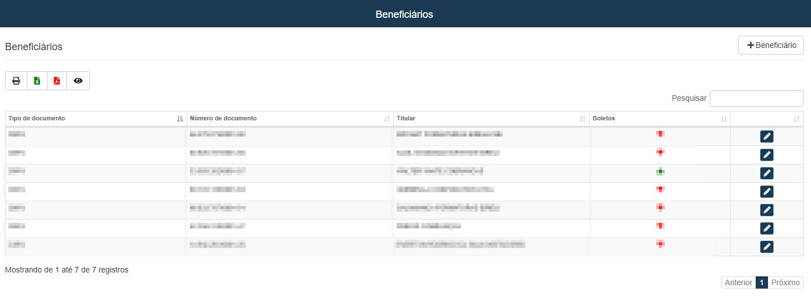

#  Beneficiários
**Campo com a função de cadastrar e editar beneficiários**
***

### Novo Beneficiário

#### **Campos para cadastro :**

* `Tipo do Documento` - Selecione o tido do documento do beneficiario
* `Número do Documento` - Insira o número do documento
* `Nome Titular` - Informe o nome do titular
***
1. Endereço
    - `CEP` - Insira o CEP de moradia do beneficiário
    - `Logradouro` - Informe o nome da rua
    - `Número` - Insira o numero da casa ou apartamento
    - `Complemento` - Informe um complemento para facilitar a localização
    - `Bairro` - Insira o nome do bairro
    - `Estado` - Informe o Estado do beneficiário
    - `Cidade` - Informe a cidade de moradia do beneficiário

***
 

### Beneficiários já cadastrado
 
