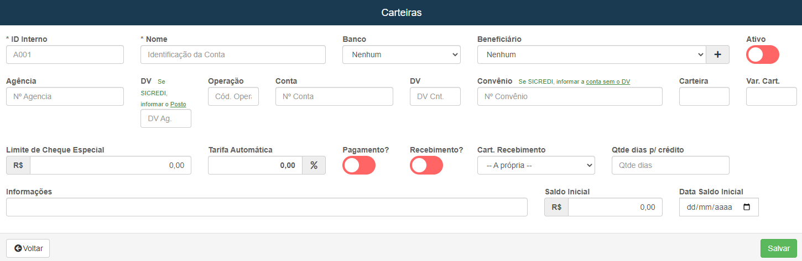

# Carteiras
**Campo com a função de editar e cadastrar novos tipos carteiras**
***

### Nova Carteira

#### **Campos para cadastro :**

* `ID Interno` - Insira um ID para identificação interna
* `Nome` - Insira um nome para identificação da Conta
* `Banco` - Selecione um banco
* `Beneficiário` - Selecione um beneficiário já cadastrado
* `Ativo` - Informe se a carteira ainda está ativa
* `Agência` - Insira o número a agência
* `DV` - Informe o digito verificador da agencia| **Se SICREDI informar o posto**
* `Operação` - Informe o Código da operação
* `Conta` - Digite o número da conta
* `DV conta` - Informe o digito verificado da conta
* `Convênio` - Informe o número do convênio| **Se o SICREDI informar a conta sem o dígito verificador**
* `Carteira` - Informe a carteira
* `Var. Cart` - Informe a variação da carteira
* `Limite de Cheque Especial` - Insira um limite em reais para o cheque especial
* `Tarifa Automática` - Insira um valor percentual para tarifa automática
* `Pagamento` - Informe se a carteira faz pagamentos
* `Recebimentos` - Informe se a carteira recebe pagamentos
* `Carteira Recebimento` - Informe qual é a carteira de recebimento
* `Quantidade de dias por Crédito` - Insira uma quantidade de dias por crédito
* `Informações` - Dê informações adicionais
* `Saldo Inicial` - Informe um valor inicial
* `Data Saldo Inicial` - Informe uma data para o saldo inicial

