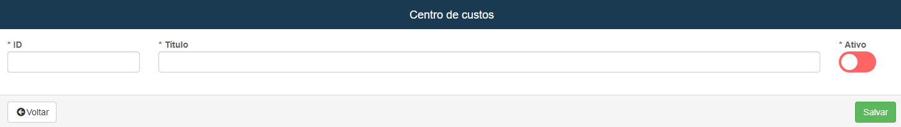
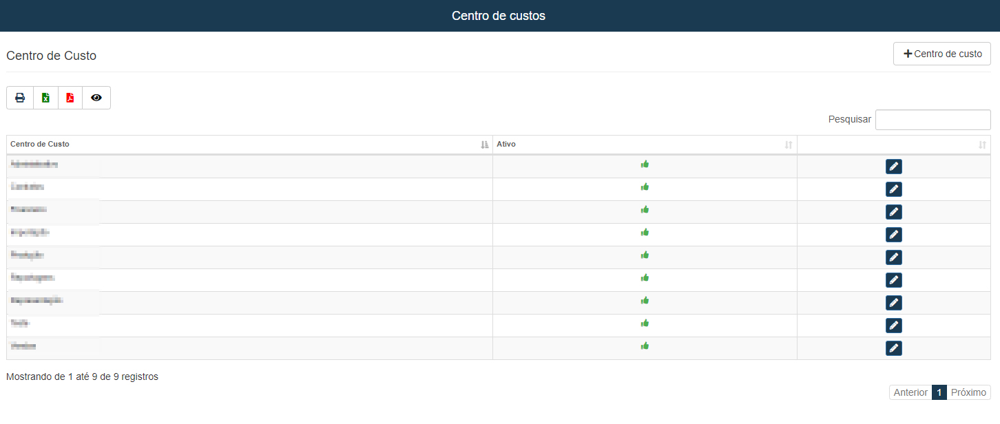

# Centro de Custos
**Campo com a função de cadastrar novos campos para custo**

### Novo Centro de Custo

#### **Campos para cadastro**:

* `ID` - Informe um ID para o cadastro
* `Titulo` - Insira um título / nome para localização
* `Ativo` - Informe se ainda está ativo

***
 

### Centros já cadastrado:
 
