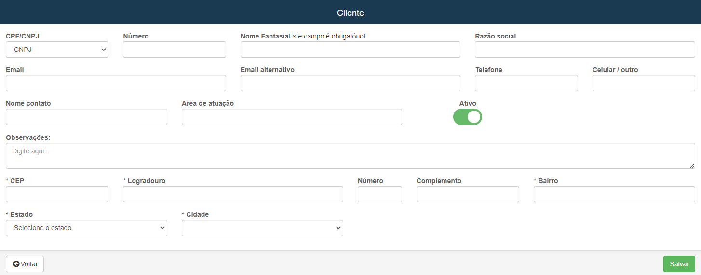

# Cliente
**Campo com a função de editar e cadastrar novos clientes**
***

### Novo Cliente

#### **Campos para preencher :**

* `Tipo do Documento` - Informe o tipo do documento
* `E-mail` - Insira um E-mail para contato
* `E-mail Alternativo` - Informe um E-mail alternativo caso seja preciso
* `Telefone` - Informe um numero de telefone
* `Celular / Outro` - Insira um numero celular ou um outro meio de contato
* `Nome Contato` - Informe o nome do contato
* `Area de Atuação` - Informe a área de atuação do cliente
***
1. CPF 
    - `Numero` - Informe o numero do CPF
    - `Nome` - Insira o nome completo do cliente
2. CNPJ
    - `Numero` - Insira o numero do documento do cliente
    - `Nome Fantasia` - Informe o nome Fantasia da Empresa| **Nome de fachada da empresa**
    - `Razão Social` - Insira a Razão social da Empresa| **Nome formal da empresa**
3. Endereço
    - `CEP` - Insira o CEP do cliente
    - `Logradouro` - Informe o nome da rua do cliente a ser cadastrado
    - `Número` - Insira o número da casa ou apartamento
    - `Complemento` - Insira um complemento para localização
    - `Bairro` - Insira o nome do bairro do cliente
    - `Estado` - Informe o estado de moradia do cliente
    - `Cidade` - Informe a cidade de moradia do cliente

