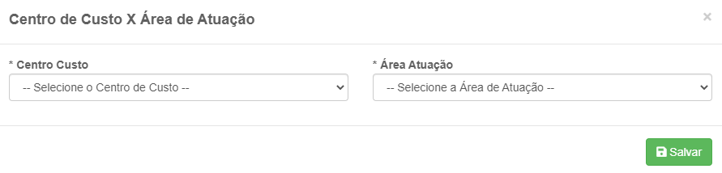
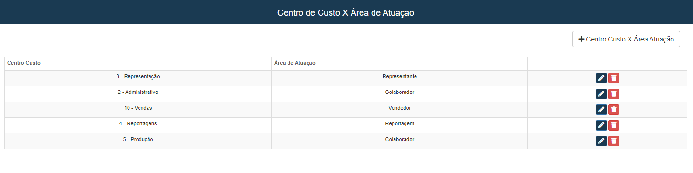

# Custo e Área de Atuação
**Campo com a função de cadastrar tipos de centros de custos e suas areas de atuação**
***

### Novo Centro 

#### **Campos para preencher :**

* `Centro de Custo` - Selecione um centro de custo já cadastrado
* `Área de Atuação` - Selecione uma área de atuação

***
 

### **Listagem de centros cadastrados :**
 

***