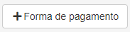
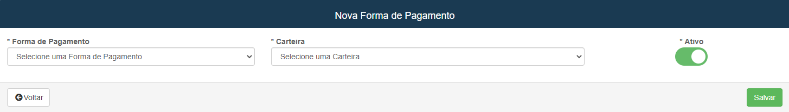

# Formas de Pagamento
**Campo com a função de cadastrar e editar formas de pagamento**
***

### Nova Forma de Pagamento

#### **Campos para cadastro**:

* `Formas de Pagamento` - Selecione um método para o pagamento
* `Carteira` - Selecione uma carteira já cadastrada
* `Ativo` - Informe se o pagamento ainda está ativo
* **Algumas formas de pagamento tem campos extras**
***
1. Boleto
    - `Token Cadente` - Insira o token do boleto
    - **Somente para o Sicredi:**
    - `Chave Privada` - Informe a chave privada do banco
    - `Chave Dinâmica` - Chave carregada dinamicamente
    - `Posto` - Informe o Posto da Conta
2. Cartão de Crédito e Débito
    - `Número de Estabelecimento` - Informe o número do estabelecimento

