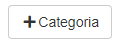
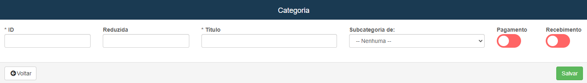
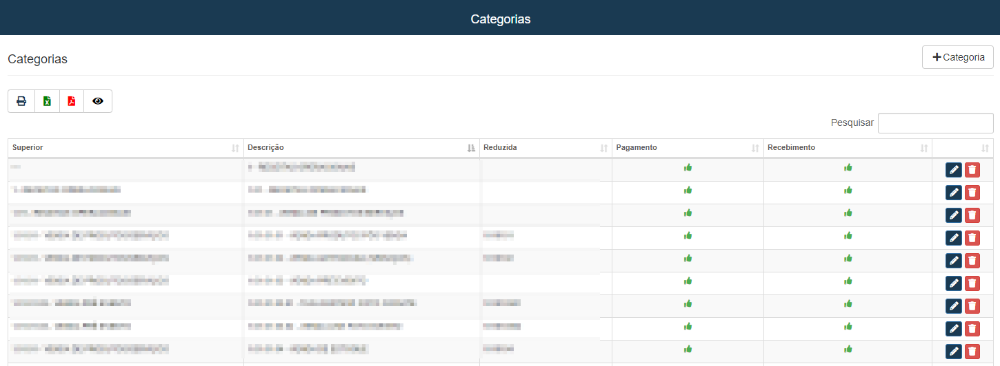

# Plano de Contas
**Campo com a função de cadastrar contas para futuros pagamentos**
***

### Nova Conta

#### **Campos para preencher :**

* `ID` - Insira um ID para a conta
* `Reduzida` - Insira uma reduzaida para facilitar a localização
* `Título` - Informe um titulo para a conta
* `Subcategoria de:` - Selecione uma subcategoria já cadastrada
* `Pagamento` - Informe se a conta faz pagamentos ou não
* `Recebimento` - Informe se a conta recebe pagamentos ou não

***

### **Listagem de Contas :**
 
