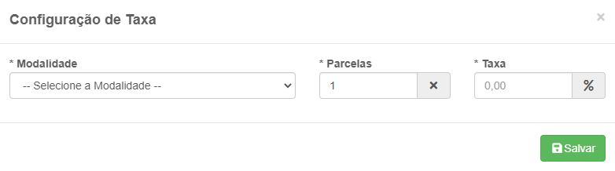
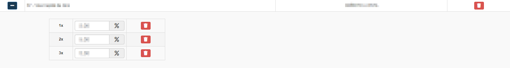
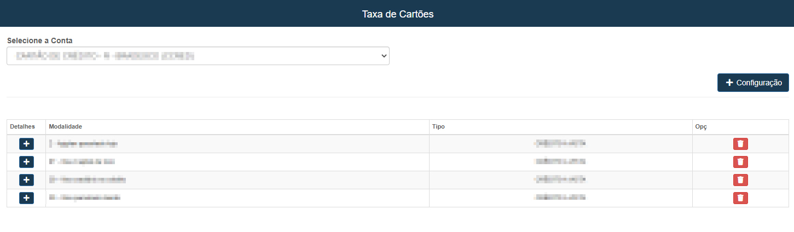

# Taxa de Cartões
**Campo com a função de vizualizar e cadastrar taxas para os cartões**
***

* ##### **Selecione uma conta**

### Nova Taxa :

#### **Campos para cadastro :**

* `Modalidade` - Selecione uma modalidade para taxa
* `Parcelas` - Informe um valor para parcelas
* `Taxa` - Insira um valor percentual para a taxa do cartão

### Vizualizar Detalhes da Taxa
***
 

***

### **Listagem das taxas :**
 

***