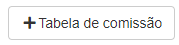
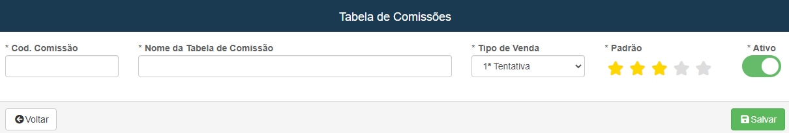
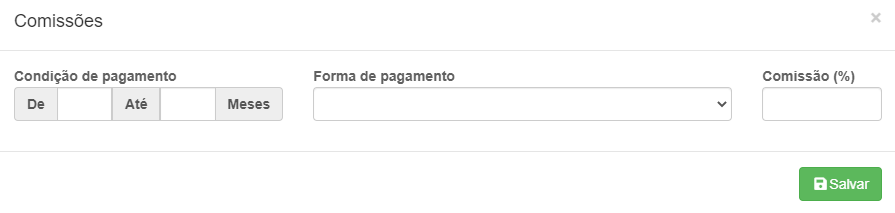
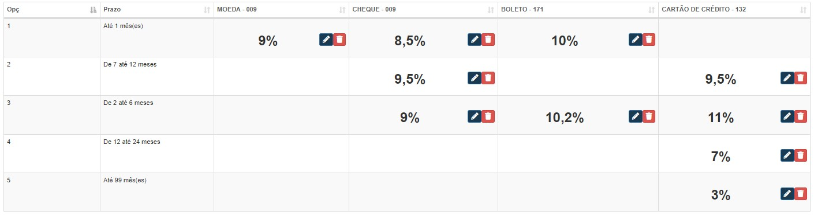

# Tabela de Comissão
**Campo com a função de cadastrar tabelas de comissões**
***

### **Nova Tabela**

#### **Campos para preencher :**

* `Codigo da Comissão` - Insira um codigo da comissão para facilitar a procura
* `Nome da Tabela de Comissão` - Insira um nome para a tabela
* `Tipo de Venda` - Informe para qual é a tentaiva de venda
* `Ativo` - Informe se está ativo

**Após criar uma nova abá aparecerá, para que você adicione a porcentagens da tabela**
***

### **Nova Forma de Pagamento :**

#### **Campos para preencher :**

* `Mês de inicio` - Insira um valor para o mês de inicio do pagamento
* `Mês final` - Insira o mês maxímo para está forma de pagamento
* `Forma de pagemento` - Selecione o meio de pagamento
* `Comissão` - Informe o valor da comissão

***

**Exemplo: Supondo que a forma de pagamento escolhida sejá moeda, a venda será feita a vista, então vendedor receberá uma comissão baseada na forma de pagamento e na quantidade de tempo**

