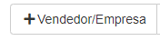
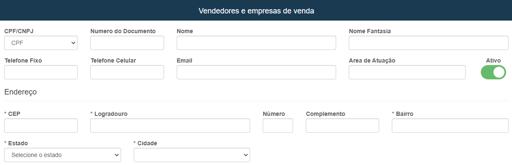
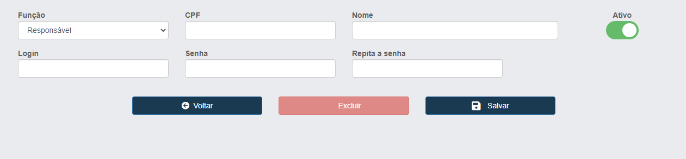
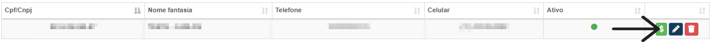
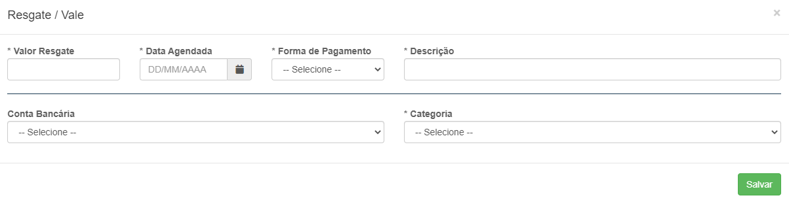

# Vendedores e empresa 
**Campo com a função de cadastrar e gerenciar empresas e vendedores para vendas dos produtos**
***
### Novo vendedor

#### **Campos para cadastro**:

* `Tipo do Documento` - Informe o tipo do documento do vendedor
* `Número do Documento` - Insira o número do documento
* `Nome` - Informe o nome completo do vendedor
* `Nome Fantasia` - Insira o nome fantasia| **Nome de fachada**
* `Telefone Fixo` - Digite o número de um telefone fixo para contato
* `Telefone Celular` - Insira um telefone celular para contato
* `E-mail` - Digite um e-mail para contato
* `Área de Atuação` - Informe a sua área de atuação
***
1. Endereço
    - `CEP` - Digite o CEP
    - `Logradouro` - Insira o nome da rua
    - `Número` - Insira o nome da casa ou apartamento
    - `Complemento` - Insira um complemento para facilitar a localização
    - `Bairro` - Informe o nome do bairro
    - `Estado` - Selecione o Estado
    - `Cidade` - Selecione a Cidade
 

* **Abaixo você terá uma opção para cadastrar vendedores**

### Novo Vendedor

#### **Campos para cadastro**:

* `Função` - Selecione uma função para o vendedor| **Responsável ou Vendedor**
* `CPF` - Insira o CPF do vendedor
* `Nome` - Informe o nome do vendedor
* `Login` - Insira um e-mail/login para o vendedor
* `Senha` - Insira uma senha para o vendedor
* `Repita a Senha` - Repita a senha

### Conta-corrente do vendedor

* **Selecione um Vendedor**

****

#### Resgate

##### **Campos para preencher**:

* `Valor Resgate` - Insira um valor para resgate
* `Data Agendada` - Insira uma data agendada para o pagamento cair
* `Forma de Pagamento` - Informe um meio de pagamento
* `Descrição` - De uma descrição do pagamento
* `Conta Bancária` - Selecione a conta bancária do vendedor
* `Categoria` - Selecione uma categoria para o pagamento
 

* **!!! Um vendedor também é um fornecedor**