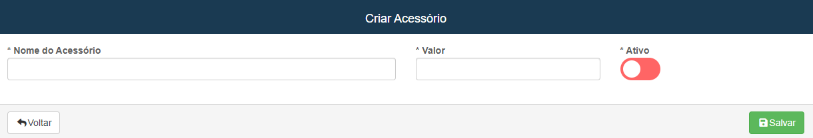
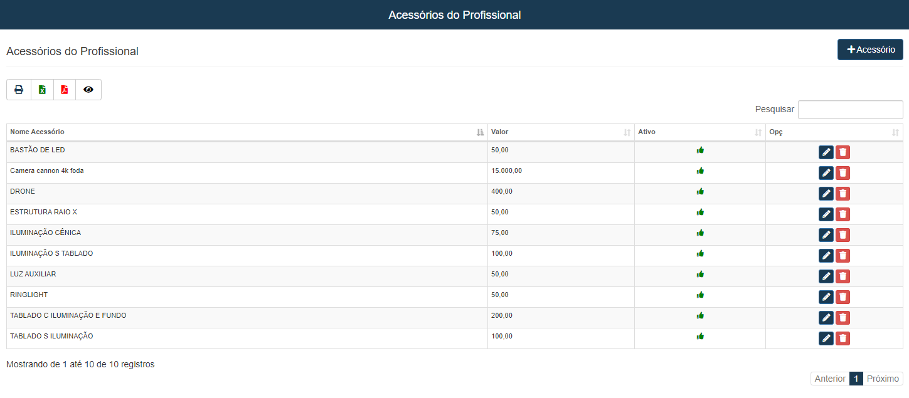

# Acessórios do Profissional
**Campo com a função de exibir e cadastrar acessórios para os profissionais**
***
### Novo Acessório

#### **Campos para cadastro**

* `Nome do Acessório` - Insira o nome do acessório que deseja cadastrar
* `Valor` - Informe o valor do produto
* `Ativo` - Informe se o acessorio será usado
 

***
 

### **Listagem de acessórios já cadastrado:**
 

***