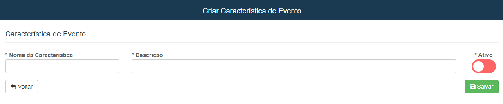
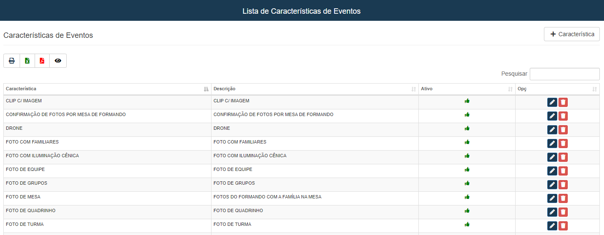

# Características de Eventos
**Campos com a função de cadastrar características para alguns eventos**
***

### Nova característica

#### **Campos para cadastro**:

* `Nome da caraterista` - Nome para característica
* `Descrição` - De uma descrição detalhada da característica
* `Ativo` - Opção para demonstra se a característica está em uso
 

***
 

### **Listagem de algumas características de eventos:**
 

***