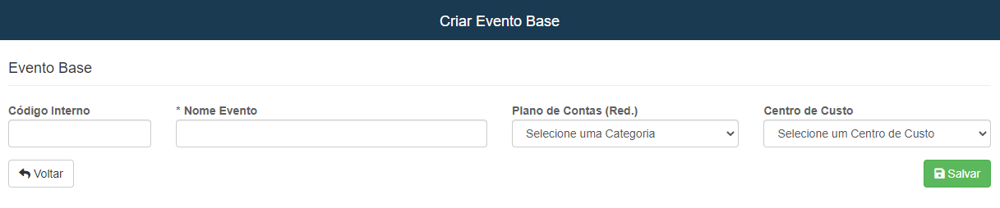
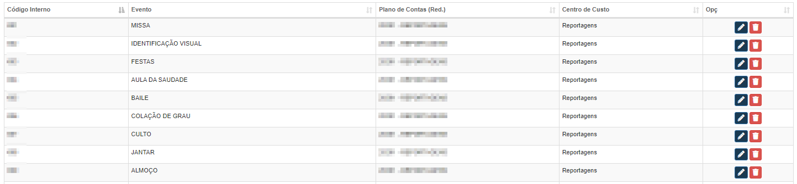

# Lista de Eventos Base
**Campo com a função de exibir e cadastrar eventos para formaturas**
***
### Novo Evento

#### **Capôs para cadastro**:

* `Código Interno` - Insira um código interno
* `Nome Evento` - Informe o nome do evento
* `Plano de Contas` - Selecione um plano de contas já cadastrado
* `Centro de Custo`- Escolha um centro de custo para o evento
 

***
 

### **Listagem de Eventos:**
 

***