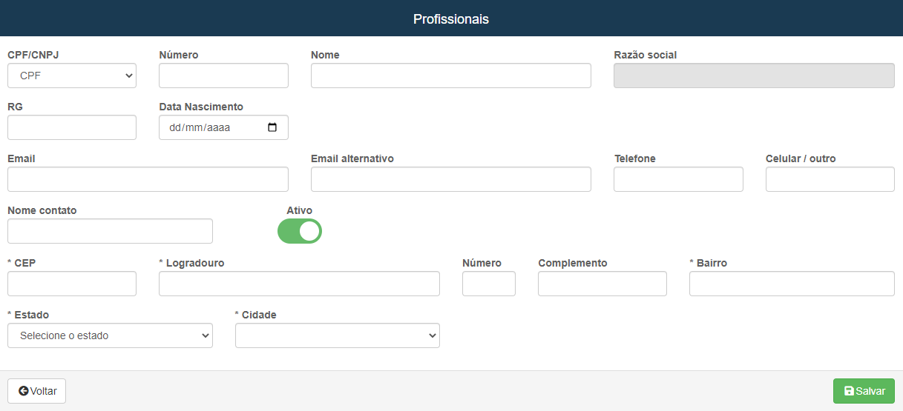

# Profissionais
**Campo com a função de gestar e cadastrar profissionais que irão trabalhar em eventos  **
***

### Novo Profissional

#### **Campos para cadastro**:

* `Tipo do documento` - Selecione o tipo do documento
* `E-mail` - Insira um e-mail para contato
* `E-mail alternativo` - Informe um e-mail alternativo| **Campo opcional**
* `Telefone` - Informe um telefone para um meio de contato
* `Celular / Outro` - Insira um celular ou outro meio para contato
* `Nome contato` - Informe o nome do contato
***
1. Tipo CNPJ
    - `Número` - Insira o número do CNPJ da empresa
    - `Nome fantasia` - Informe o nome fantasia da empresa| **Nome de fachada**
    - `Razão social` - Insira a razão social da empresa| **Nome formal da empresa**
    - `IE` - Insira o IE do documento
2. Tipo CPF
    - `Número` -Insira o número do CPF do profissional
    - `Nome` - Informe o nome completo do profissional
    - `RG` - Insira o RG do documento
    - `Data de nascimento` - Informe a data de nascimento do profissional
3. Endereço
    - `CEP` - Digite o CEP do profissional ou da empresa
    - `Logradouro` - Informe o nome da rua da empresa ou da moradia do profissinal
    - `Número` - Número de localização da empresa ou da moradia do profissional
    - `Complemento` - Informe um complemento para facilitar a localização
    - `Bairro` - Digite o nome do bairro da localização da empresa ou do profissional
    - `Estado` - Selecione o Estado
    - `Cidade` - Selecione a cidade
 
 

* **Após salvar, a empresa ou você mesmo deve cadastrar os funcionários, caso seja uma empresa deve-se cadastrar todos os funcionários, caso seja apenas uma pessoa precisa-se cadastrar apenas uma pessoa**
***
### Novo Funcionário

#### **Campos para preencher**:

* `Nome` - Insira o nome do funcionário
* `CPF` - Informe o CPF do funcionário
* `Login` - Crie um login para o funcionário
* `Senha` - Crie uma senha para ele
* `Ranking` - Informe o nível do funcionário
***

* **!!! Profissionais também são fornecedores**

* **Logo ao entrar na Aba, você terá a opção de adicionar uma conta bancaria**

[Cadastro de conta bancária](https://rfsolutionit.github.io/myphotos/pages/cadastro/estoque/fornecedores.html#cadastro-conta-bancaria)

