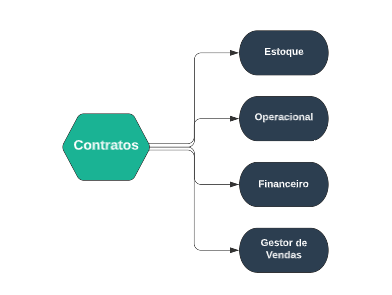

## Contratos
***
 

##### **Definições**

O Módulo de Contratos tem a função principal de cadastrar formaturas, mas para isso
alguns outros campos precisa ser cadastrado antecipadamente 

O cadastro do Módulo de contrato tem as opções de cadastrar temporadas,
cursos, tipos de custos, representantes, etc.

Já o campo gerenciamento tem a opção de cadastrar um nova [proposta comercial](https://rfsolutionit.github.io/myphotos/pages/gerenciamento/contrato/proposta-comercial.html) e
analisar contratos em execução ou finalizados

O último campo tem a função de mostrar relatórios dos custos dos contratos, a
programação de pagamentos e, além disso, a consulta geral dos formandos

O Módulo de contrato é o principal para o funcionamento de todos os módulos

##### **Características**

* Permite cadastrar formaturas
* Permite cadastrar temporadas para formaturas
* Permite cadastrar faculdades e curso
* Também permite criar propostas comerciais
* Além de Permitir que mostre um relatório de formandos cadastrados
* Programação de pagamento, etc.

##### **Visão Geral**

O Módulo está ligado principalmente em cadastrar contratos

Neste Módulo você pode cadastrar temporadas para o o corrimento de formaturas, também pode 
cadastrar curso para essas formaturas

Mas o principal objetivo deste Módulo será a criação de contratos, mas para que estes
contratos podem ser cadastrados algumas outras opções, devem ser cadastradas anteriormente.
Como deve-se cadastrar anteriormente, um representante, uma temporada, uma proposta comercial, etc.

Após o cadastro de todos os campo essenciais, você poderá cadastrar os contratos de formaturas 

Ao clicar em nova formatura você deve preencher os campos e selecionar opções extras, após criar 
um contrato, novas opções aparecerão, como, você pode cadastrar os formandos, produtos
que serão vendidos, custo e brindes, etc.

