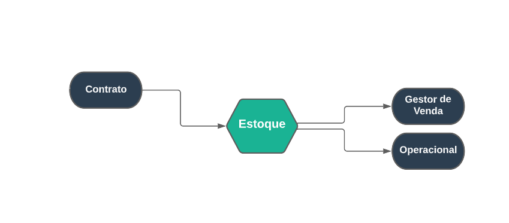

## Estoque 
***
 

##### **Definições**

O Modulo do estoque está ligado principalmente com produtos para a venda

Neste Modulo você pode cadastrar locais para estoque, produtos para vendas, fornecedores, movimentar produtos, gerenciar 
todos os produtos cadastrados, e fazer uma análise dos produtos cadastrados 

O Campo do cadastro tem a função de cadastrar produtos, locais para estoque, etc.

No Campo gerenciamento você pode realizar a movimentação de produtos e fazer uma gestão sobre esses produtos

O Modulo do estoque depende dos contratos além de ser responsável para os módulos de gestor de vendas e o operacional

##### **Características**

* Permite o cadastro de produtos para a vendas
* Permite o cadastro de locais para estoque 
* Permite o cadastro de fornecedores
* Permite a gestão de produtos
* Permite realizar a movimentação de produtos para estoques
* Permite realizar um relatório sobre os produtos

##### **Visão Geral**

O Modulo estoque pode ser iniciado pelo cadastro de produtos e também cadastrando o valor desses produtos, após com o 
cadastro de locais para estoque

Caso precise, vá em gerenciamento e em ordem de movimentação avançada para poder trocar o local de estoque, 
essas transações acontecem quando uma venda é iniciada e os produtos saem do estoque principal para as mãos do
vendedor ou quando um vendedor termina uma venda e alguns produtos não são vendidos, então essa transação deve
ocorrer novamente para o estoque principal

Além disso, você pode ter um relatório sobre os produtos cadastrado

