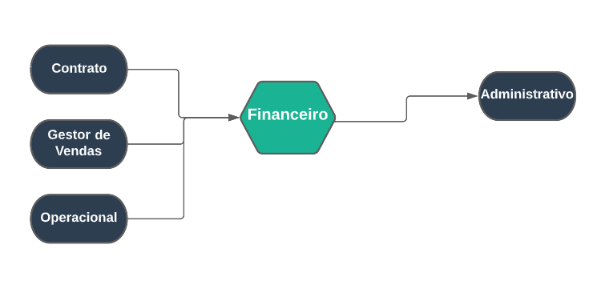

## Financeiro
***
 

##### **Definições** 

O Modulo do financeiro é um módulo muito complexo com muitas opções sobre pagamentos e custos

O Modulo financeiro está ligado totalmente com faturas e vendas e os clientes

Este Modulo permite o cadastro de fornecedores, taxa para cartões, clientes, carteiras, beneficiários,
plano de contas e muito mais, além de puder realizar cobranças sobre clientes no ambiente do cobrador
também podendo gerenciar cobranças de clientes, no campo de conciliação você pode conferir o extrato
bancários das contas

No Campo de movimento você pode cadastrar e gerenciar programações de pagamentos, criar transações,
gerenciar movimentos financeiros além de lançar folhas de pagamentos, gerenciar cartões, cobranças
bancárias e contas que estão a receber e a Pagar

Já o campo relatório pode fazer um relatório de contas correntes, saldos de carteiras, etc.

O Modulo Financeiro está ligado com os módulos de contrato, gestor de vendas, operacional e o administrativo

##### **Características**

* Permite cadastrar fornecedores
* Permite cadastrar um beneficiário
* Permite cadastrar carteiras e formas de pagamentos
* Permite realizar cobranças sobre clientes
* Permite gerenciar extratos bancários
* Permite realizar movimentos financeiros
* Permite gerenciar e cadastrar contas para receber e pagar
* Permite realizar transações entre carteiras
* Permite ter um relatório sobre carteiras
* Permite ter um relatório sobre recebimentos

##### **Visão Geral**

Neste modulo você pode cadastrar carteiras, essas carteiras podem ser configurada para poderem ser apenas uma carteira para receber ou pagar 

Essas carteiras é preciso cadastrar uma contá bancária para poder realizar pagamentos 
ou receber pagamentos, além de precisar inserir um beneficiário, banco, nome para a carteira, etc.

Você também pode cadastrar formas de pagamentos para carteiras

No Campo de movimento você pode gerenciar e cadastrar pagamentos de cobranças de existentes
além de poder realizar transações, gerenciar cheques, cobrança bancária, cheques, etc;
Mas os principais campos desse modulo são o movimento financeiro e contas a pagar e receber

No Campo movimento financeiro, neste modulo tem a principais funções de cadastrar e gerência
movimento financeiro

Em contas a receber é um campo com várias opções podendo cadastrar contas para receber e 
gerenciar contas cadastradas, além de poder realizar pagamentos, existem funções como
de gerar boletos, realizar movimentações, inativar contas, mas o principal objetivo 
é de receber pagamentos 

Já em contas a Pagar também é um campo muito completo, mas sua principal função não é 
tão diferente quanto o contas a receber, seu objetivo é realizar pagamentos para contas.
O Conta a Pagar é um campo que todas contas que devem ser paga estará localizada neste
modulo

No módulo de relatório tem muitas opções com cada uma com suas próprias funções, mas os
principais campos são os saldo em carteiras, relatório de contas correntes e o Provisionamento
Financeiro

