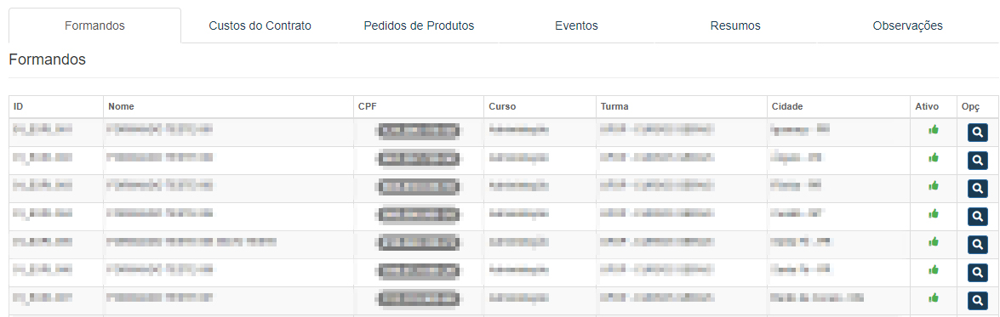
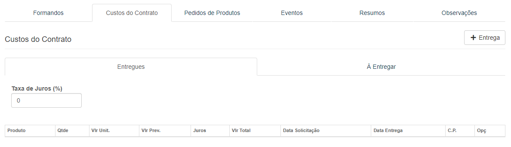
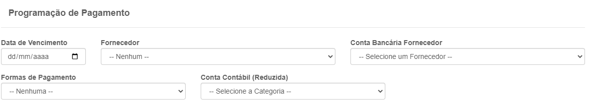

# Execução de Contrato
**Campo com a função de gerenciar e informar a situação dos contratos**
***

### Filtro de pesquisa

* `Temporada` - Temporada que ocorrerá evento que procura
* `Representante` - Representante do evento que procura
* `Estado` - Estado onde acontecerá a formatura que procura
* `Cidade` - Cidade onde acontecerá a formatura que procura
* `Situação` - Situação de como está o evento que procura
* `Data inicial da execução` - Dia da execução do evento
* `Data final da execução` - Dia da final do evento
* `Data de início da assinatura` - Data para o início da assinatura 
* `Data de término da assinatura` - Data para o fim da assinatura
* `Padrão` - Importância do evento para a empresa
***

### Listagem de contratos

***

## Visualizar contrato
**Função visando visualizar o contrato**

***

### Dados do Contrato

* `Ver Turmas` - Opção com a função de gerenciar turmas cadastradas no contrato
* `Ver Produtos para Venda` - Campo com a função de gerenciar as vendas de produtos
* `Ver Cláusulas Contratuais` - Campo que possibilita gerenciar cláusulas do contrato

### Opções do Contrato

***

### Formandos
**Aba Com a função de gerenciar formandos já cadastrado**

#### Visualizar Formando

### Custo do Contrato
**Campo capaz de gerenciar, adicionar e editar produtos**
***

#### Nova entrega

##### **Campos para preencher**:

* `Tipo de Entrega` - Escolha um tipo de entrega| **Prevista ou Normal**
* `Custo` - Selecione um tipo de custo para a entrega
* `Quantidade` - Quantidade do produto
* `Custo Unitário` - Insira um custo por cada unidade
* `Custo Total` - Valor total a ser pago
* `Espécie de Pagamento` - Escolha um meio de pagamento
* `Data Solicitação` - Insira a data de solicitação
* `Data Programada para Entrega` - Insira uma data programada para entrega
* `Conta a Pagar` - Caso a conta não foi paga assinale a opção
1. **Tipo prevista**
    - Escolha uma descrição
2. **Conta a Pagar**
    * `Data de Vencimento` - Insira uma data para o vencimento
    * `Fornecedor` - Escolha o fornecedor
    * `Conta Bancária Fornecedor` - Insira a conta bancária do fornecedor
    * `Formas de Pagamento` - Escolha um meio de pagamento
    * `Conta Contábil (Reduzida)` - Selecione uma opção
     
    
    

***

***
### Pedidos de Produtos
**Campo com a função de gerenciar e cadastrar produtos**
***

#### Novo Pedido

##### **Campos de cadastro**

* `Tipo` - Selecione um tipo para o produto| **Normal ou Pedido Extra**
* `Produto` - Selecione um produto já cadastrado
* `Quantidade` - Informe a quantidade do produto
* `Custo Unitário` - Insira um valor para cada unidade
* `Data Solicitação` - Insira a data de solicitação
* `Data Programação` - Selecione uma data programada
* `Custo Total` - Custo total por cada unidade
1. Conta a Pagar
    - **Campos para preencher**
    - Caso o pedido não foi pago, assinale a opção 
    - `Data de vencimento` - Insira uma data de vencimento para o pagamento
    - `Fornecedor` - Escolha um fornecedor já cadastrado
    - `Conta Bancária do Fornecedor` - Insira a conta do fornecedor
    - `Conta contábil (Reduzida)` - Selecione uma opção
    - `Carteira` - Selecione uma carteira
    - `Centro de Custo` - Escolha um meio de custo  
     

    

***

***
### Eventos
**Aba com a função de gerenciar e facilitar o cadastro de novos eventos**
***

### Resumo
**Campo com a função de gerenciar o total de gastos**

