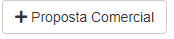
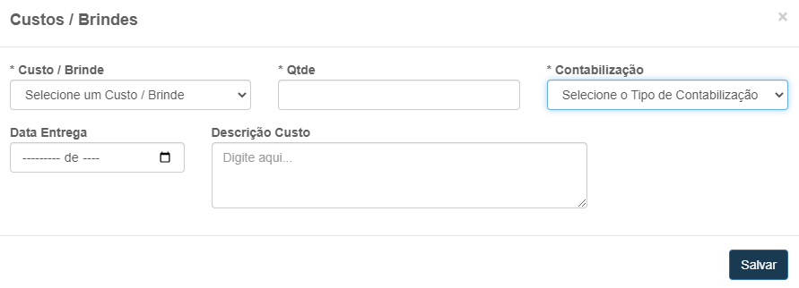
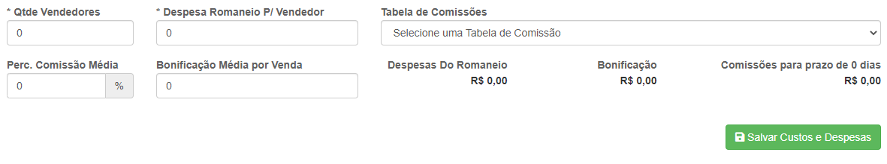
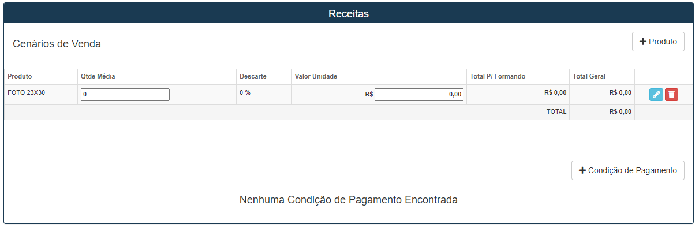
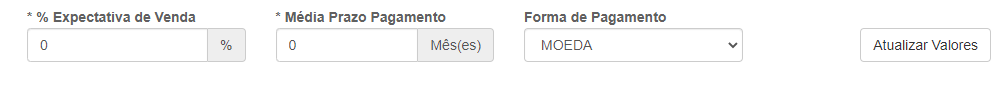

# Proposta Comercial

**Função opcional para o cadastro de propostas comerciais**
***

### Cadastrar nova proposta

#### **Campos para preencher**:

* `Nome Proposta` - Insira um nome para a localização de sua proposta
* `Estado` - Estado onde ocorrerá a propota
* `Cidade` - Cidade onde ocorrerá a proposta
* `Temporada` Escolha uma temporada para que ocorra a proposta
* `Representante` - Insira o nome do representante
* `Membro Comissão` - Insira o nome do representante da turma
* `Contato Comição` - Insira um meio de contato do representante da turma
* `Quantidade de Formandos` - Insira um numero de formandos
* `Data Provável de Assinatura` - Insira uma data provavel para a assinatura
* `Data da Formatura` - Insira uma data para a formatura
* `Data Prevista de Venda` - Data prevista para vendas de produtos| **Campo não modificavel**
* `Tempo de Execução do contrato` - Insira o tempo em meses para a execução do contrato
* `Faculdade` - Escolha a faculdade onde ocorreá a proposta
* `Cerimonial` - Escolha um cerimonial já cadastrado para fornecer a formatura

##### **Campos opcionais**:
* `Fotos` - Caso queira produzir as fotos para o evento ative a opção
* `Videos` - Caso queira produzir videos para o evento ative a opção
* `Organização` - Caso outra empresa organize a formatura deixe a opção desativada
 

***

## Membros Comissão
**Logo após salvar a proposta o campo tem a função de adicionar novos membros de comissão**
***
### Cadastrar novo membro

#### **Campos para preencher**:

* `Papel Comissão`- Escolha o papel do membro a ser cadastrado| **Presidente, vice-presidente e etc...** 
* `Nome Membro` - Insira o nome complento do membro
* `RG` - Insira o RG do membro que deseja cadastrar
* `CPF` - Insira o CPF do membro que deseja cadastrar
* `Curso` - Escolha um curso já cadastrado para o membro
* `Turma` - Insira a turma de seu membro que deseja cadastrar
* `Telefone 1` - Insira um telefone para o contato com o membro| **Campo obrigatorio**
* `Telefone 2` - Insira um segundo telefone para contato| **Campo opicional**
* `E-mail` - Insira um E-mail para contato
* `CEP` - Insira o CEP do membro
* `Logradouro` - Insira o nome da rua do membro a cadastrar
* `Numero` - Insira o numero da casa ou apartamento
* `Complemento` - Insira um complemento para localização 
* `Bairro` - Insira o nome do Bairro 
* `Estado` - Insira o estado do membro
* `Cidade` - Insira a cidade do membro

***

## Custo / Brindes

**Campo com a função de cadastrar brindes para o evento**
***

### Cadastrar Brinde

#### **Campos que devem ser preenchidos**:

* `Custo / Brinde` - Escolha um tipo de brinde já cadastrado
* `Quantidade` - Insira a quantidade de brindes
* `Contabilização` - Escolha o tipo de contabilização| **Por formando ou Por produto**
* `Data Entrega` - Insira uma data de entrga para os brindes
* `Descrição Custo` - De uma descrição do custo| **campo não obrigatório**
1. **Por Formando**
    - Numero de brindes sera igual ao numero formando
2. **Por produto**
    - Numero de brindes sera a quantidade

***
## Editar Proposta
**Logo ao entrar no campo de porposta comercial sera redirecionado para uma pagina de gerenciamento com a possibilidade de editar propostas**
*** 

## Avaliar proposta
**Alem da opção de editar também podemos avaliar a proposta para que ela possa continuar em frente**
***

***
##### Logo ao clicar você será redirecionado para uma nova aba, que descendo pode encontrar:

## Contratuais e de Execução
**Esta campo tem a função de criar e gerenciar brindes**
***

#### **Campos**:

* `Quantidade` - Campo pode ser alterado
* `Valor Unidade` - Insira um valor para cada unidade
 

***
## Operacionais

**Campo com a função de adicionar e gerenciar novos operacionais**
***
### Cadastrar Operacional

#### **Campos para preencher**:

* `Evento` - Escolha o evento que deseja realizar
* `Quantidade de Formandos` - Insira o numero de formandos
* `Quantidade de Profissionais` - Insira a quantidade de profissionais que vão trabalhar nesse evento
* `Custo por profissional` - Insira um custo para os funcionarios
* `Outras Despesas` - Insira um valor estimado de despesas

#### **Campos Alteraveis**:

* `Profissionais` - Numero de profissionais que irão trabalhar no evento
* `Custo por Profissional` - Valor a ser pago por funcionario
* `Outras Despesas` - Valor de possiveis despesas

***
## Fabricação de produtos
**Campo com a função de criar e gerenciar produtos**
***

### Cadastrar produto

#### **Campos para cadastro**:

* `Produto` - Escolha um produto já cadastrado
* `Quantidade Média` - Insira uma quantidade média de produtos
* `Descarte` - Insira uma porcentagem de quantos produtos podem ser descartado
* `Valor Unidade` - Insira um valor médio para cada unidade

#### **Campos alteraveis**:

* `Quantidade Média` - Quantidade média de produtos
* `Valor Unidade` - Valor médio por produto
 

## Outras Despesas
**Campo com a função de cadastrar e gestar despesas**

### Cadastrar nova despesa

#### **Campos para preencher**:

* `Nome da Despesa` - Insira um nome para indentificação da despesa
* `Contabilização` - Escolha o tipo de contabilização
* `Quantidade` - Insira um valor para a quantidade
* `Valor Unidade` - Insira um valor minimo para cada unidade
 

## Venda 
**Campo com a função de gerenciar as vendas dos produtos**
***

#### **Campos para preencher**:

* `Quantidade de vendedores` - Insira uma quantidade de vendedores
* `Despesa Romaneio por vendedor` - Insira um valor para despesas de romaneio para cada vendedor
* `Tabela de Comissões` - Escolha uma tabela já cadastrada
* `Perc. Comissão Média` - Insira uma porcentagem média para comissão
* `Bonificação Média por Venda` - Insira um valor bônus para cada venda
 

***
## Receitas
**Campo com a função de gestar seus metodos de lucros|receitas**
***

* **Campo posibilita a alterção de produtos, modificar preços e quantidades, além da função de cadastrar um novo produto**

### Condição de pagamento
**Função com o objetivo de adicionar uma condição de pagamento**
***

#### **Campos para o cadastro**:

* `Parcelamento Minimo` - Insira um numero minimo de parcelas
* `Parcelamento Maximo` - Insira um numero maximo de parcelas
* `Percentual de juros` - Insira um valor porcentual para juros
 

#### **Campos alteraveis**:

* `Quantidade Média` - Quantidade média do produto
* `Valor Unidade` - Valor por unidade
 

## Resultados 

**Campo com a função de gerenciar os resultado e receitas para a aprovação e rejeição**
***
#### Expectativa de venda:

**Tabela com a função de criar uma expectativa de vendas**

##### **Campos para cadastro**:

* `Expectativa de Venda` - Insira um porcentual para uma expectativa de vendas
* `Prazo Médio de pagamento` - Insira um tempo médio de pagamanto por mês
* `Forma de Pagamento` - Escolha o metodo de pagamento

### Despesas e Receitas

**Tabelas com a função de analisar quais serão suas despesas e suas receitas**
***

* `Nenhum campo deve ser cadastrado`
***

## Expectativa de resultado

**Ao canto inferior direito poderá ser encontrado uma tabela com o objetivo de mostrar uma expectativa do resultado além da opção de comfirmar ou rejeitar a proposta**

