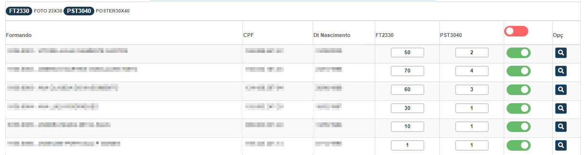

# Gestão de Produtos
**Campos com a função de cadastrar novas ordens de produção para contratos**
***

### Nova Ordem

#### **Campos para cadastro**:

* `Nome` - Insira um nome para identificação
* `Contrato` - Selecione um contrato sem uma ordem cadastrada
 

* **Logo após salvar nome e dados dos alunos irão aparecer**
***

***
 

##### **Para cadastrarmos uma nova ordem para produção presisamo assinalar a opção**

* **Para facilitar seu trabalho existe uma opção que possibilita criar uma ordem de produção para todos os formandos**

* **Caso nem todos os formandos seja preciso cadastrar uma ordem de produção, você pode ativar a opção para que todos sejam ativados e dessativar apenas aqueles que não serão utilizados ou assinalar um de cada vez**

* **Depois de ativar a opção aparecerá uma nova opção para cadastrar produtos**

## Cadastrar Produto para o Formando
**Neste campo sua função é cadastrar quais produtos foram comprado pelo formando**
***

#### **Campos para preencher**:

* `Produto` - Selecione um produto já cadastrado
* `Codigo de Barras` - Informe o codigo de barra do produto
* `Quantidade` - Insira a quantidade do produto disponivel do formand| **Recomendado inserir apenas 1 para que possa exportar para outro formandos, depôis altere manualmente**

***
#### **Exportar**

* **Campo com a função de exportar os produtos para todos os formandos selecionados**

#### **Gerenciar Movimento**
**Campo com a função de gerenciar a movimentação do produto**
***

* `Local` - Local onde o produto se está armarzenar
* `Portador` - Fornecedor / Vendedor do produto
* `Status` - Status do produto| **Disponivel, Descartado, Extraviado, Vendido, Bonificado**
* `Quantidade` - Quantidade do produto

    * **Todos os campos podem ser alterado**

***
## Gerenciar tabela
**Depois de realizar todos os passos a cima, você porderá gerenciar todos os formantes, agora você poderá alterar manualmente a quantidade de produtos para cada formando**

* **Caso queria apagar um campo de um formando, você pode ir na lupa e apagar o produto ou apenas alterar o campo deixando vazio e salve**
    