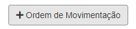
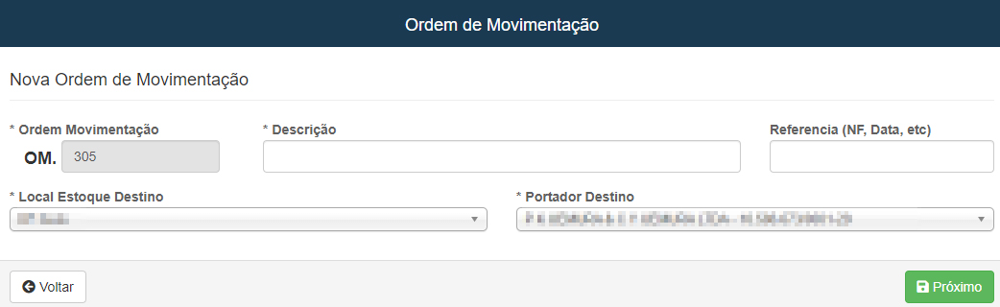
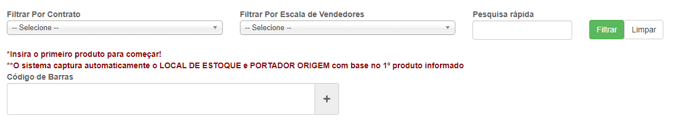
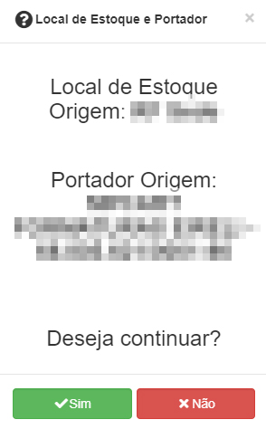
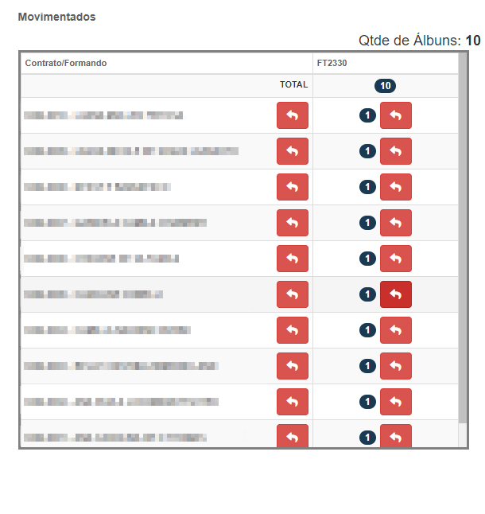
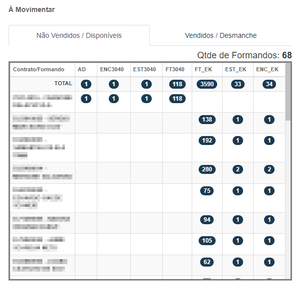

# Ordem de Movimentação
**Campo com a função de cadastrar novas ordens de movimentação**
***

### Nova Ordem

#### **Campos para preencher**:

* `Ordem de Movimentação` - Campos sequencial 
* `Descrição` - Insira uma descrição para ordem
* `Referencia` - Insira um referencia| **Nota Fisca, Data e etc...**
* `Local de Estoque Destino` - Selecione um novo local já cadastrado para destinos dos produtos
* `Portador Destino` - Selecione um novo vendedor para os produtos

* **Após salvar novas abás irão aparecer**

 

* **'Para iniciar a movimentção basta inserir o codigo de barras de cada produto, Depos da primeira movimentação aparacerá na tela uma opção para que possa continuar sua movimentação'**

 

* **Logo após aparecerá os produtos que foram movimentados**

#### Imprimir comprovante de movimentação

* **Após todos os produtos serem movidos, por segurança você deve gerar e imprimir um novo comprovante de movimentação**

***

## Pós Vendas

* **Pós a vendas, caso alguns produtos não tenha vendidos, você deverá informar**

