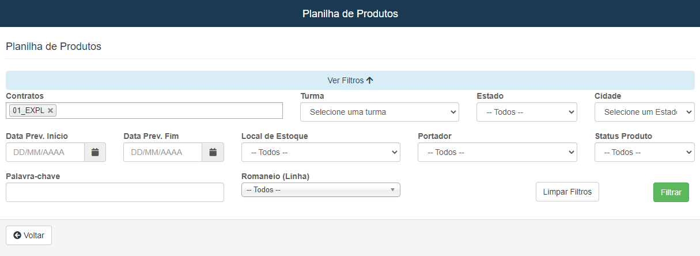
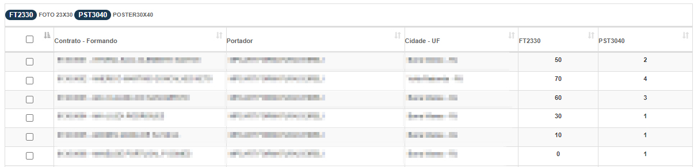
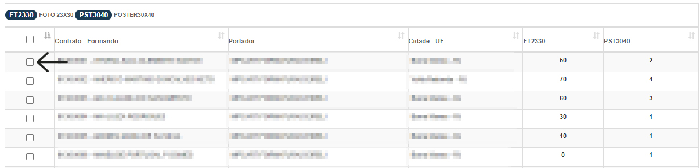

# Planilha de Produção
**Campo com a função de gerenciar contratos que tenham uma ordem de produção cadastrada**

#### **Campos para preencher**:

* `Contratos` - Selecione um ou vários contratos| **Unico Campo Obrigatório**
* `Turma` - Selecione a turma que deseja procurar
* `Estado` - Selecione o estado onde ocorreu o contrato
* `Cidade` - Selecione a cidade onde ocorreu o contrato
* `Data Prevista de Inicio das Vendas` - Insira a data privista para vendas dos produtos
* `Data Prevista para a Finalizção das Vendas` - Informe uma data prevista para o fim das vendas
* `Local de Estoque` - Informe o local de estoque dos produtos
* `Portador` - Selecione um fornecedor / vendedor dos produtos
* `Status Produto` - Selecione o status do produto 
* `Palavra Chave` - Insira uma palavra cheve pra encontrar o contrato
* `Romaneio` - Selecione o romaneio do contrato
    * **Apenas o campo de contratos é obrigatório**

***
 

#### Resultado

 
 

## Gerar Etiquetas

* **Esta opção é opcional, ela tem a capacidade gerar etiquetas para facilitção de encontrar produtos no estoque, caso queria basta assinlar estás opçoões**

