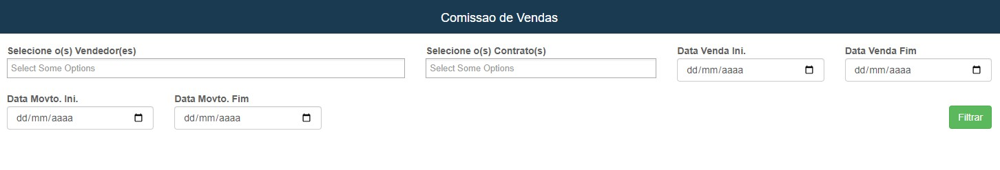
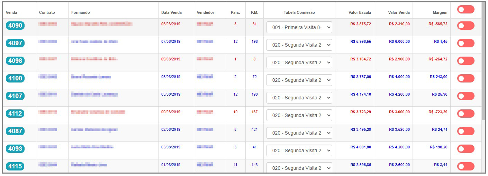
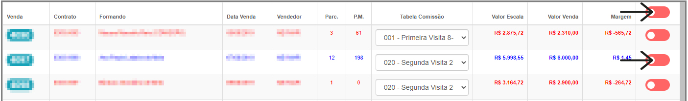
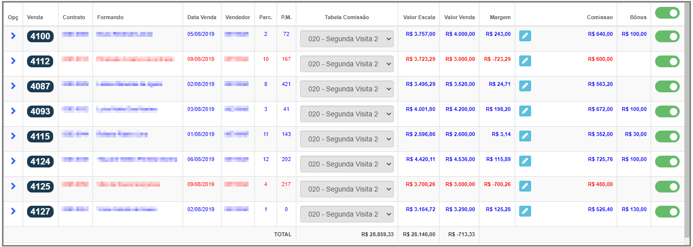
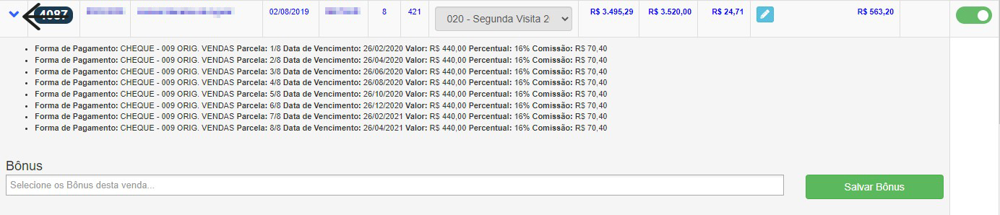
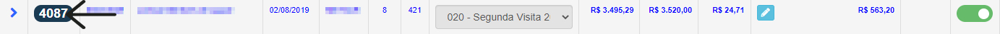
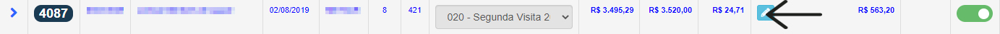

# Comissão de Vendedores
**Campo de analisar a comissão ganha por vendedores**
***

#### **Campos para pesquisa :**

* `Vendedor` - Selecione o vendedor que você deseja gerenciar sua comissões
* `Contrato` - Insira o contrato que o vendedor trabalhou
* `Data de Venda Inicial` - Informe a data de inicio das vendas dos produtos
* `Data de Venda Final` - Informe a data de finalização das vendas dos produtos
* `Data de Movimentação Inicial` - Insira a data inicial da movimentação dos produtos
* `Data de Movimentação Final` - Insira a data de finalização de movimentação dos produtos

***

## Vendas Não Processadas
**Após escolher um vendedor aparacerá novas tabelas**
***

**Selecione as vendas que deseja processar**

**É possivel caso preciso, alterar a tabela de comissão**

***

## Vendas Processadas
**Após escolher um vendedor ou processar uma venda, elas irão aparecera aqui**

**Vizualizar comissões**

***

**Após clicar você sera redirecionado para a abá da venda**

**Caso deseje alterar a comissão por algum motivo basta clicar no botão**