# Escala de Vendedores
**Campo com a função de liberar produtos para a venda**
***

### **Nova Escala**

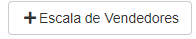

#### **Campos para preencher**

* `ID Interno` - Insira um ID para identificação da tabela
* `Nome de Identificação` - Insira um nome de identificação da tabela
* `Situação` - Informe qual é a situação da escala
***
1. Ativo
    - **Quanto a vendas está liberada ou acontecendo está opção deve ser a escolhida**
2. Inativo
    - **Caso houve um erro nas vendas e após isso a venda é cancelada está opção deve ser escolhida**
3. Fechado
    - **Quando as vendas já tiver ocorrido e finalizada, está opção deve estar selecionada**
4. Em Conferência
    - **Caso o vendedor volte ao estoque para deixar produtos, mas ainda está trabalhando, selecione a opção**
***
* `Seguir Tabela de Vendas` - Caso queira que os vendedores sigam a tabela de venda, assinale a opção
***

## Alocação de Vendas
**Campo com a função de alocar os formandos para a vendas**
***
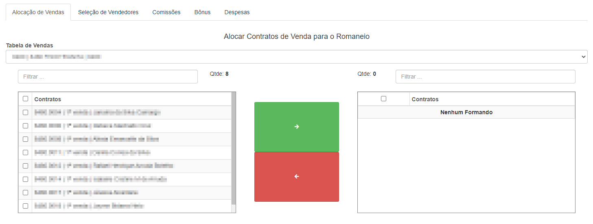

* `Tabela de Vendas` - Selecione uma tabela de vendas
* **Selecione os formandos e clique no botão verde para alocar os formandos desejados**

***
## Seleção de Vendedores
**Campo com a função de cadastrar vendedores para a venda**
***
* `Selecionar Vendedor` - Selecione o vendedor que deseja cadastrar para a escala
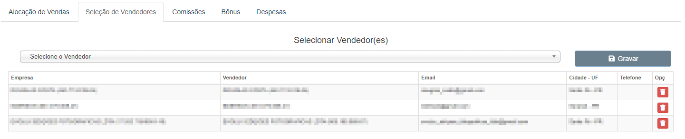

***

## Comissões
**Campo não obrigatório com a função de cadastrar a comissão da tabela**
***

### **Nova Comissão**

#### **Campo para cadastro:**

* `Tentativa de Venda` - Selecione a quantidade de tentativas
* `Tentativa` - Selecione a tabela de comissão

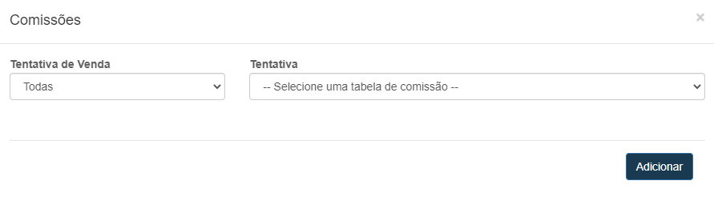
***
#### **Listagem**
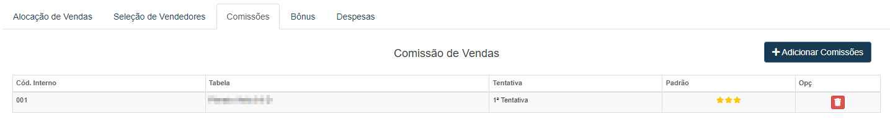
***

## Bônus
**Campo não obrigatório com a função de cadastrar bônus para vendedores**
***

### **Cadastro Bônus:**

#### **Campos para preencher:**

* `Venda` - Selecione a quantidade de vendas
* `Produto` - Selecione o produto que o vendedor deve vender para ganhar o bônus
* `Valor` - Insira o valor do bônus

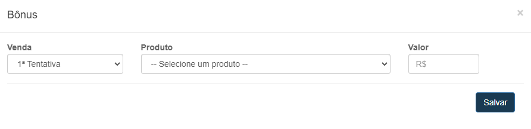
***

## Despesas
**Campo com a função de cadastrar todas as despesas que o vendedor obteve**
***

### **Nova Despesa**

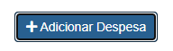

#### **Campos para cadastro**

* `Vendedor` - Selecione o vendedor da despesa
* `Categoria` - Informe o tipo da despesa
* `Documento` - Insira o número do documento
* `Razão Social` - Insira a razão social do vendedor| **Nome Formal**
* `Descrição`- Dê uma descrição para a despesa
* `Estado` - Informe o estado do vendedor
* `Cidade` - Informe a cidade do vendedor
* `Valor` - Insira o valor da despesa
* `Data` - Selecione a data da despesa
* `Situação` - Informe a situação
* `Gerar Contas a Pagar?` - Selecione caso deseje gerar um Conta a Pagar

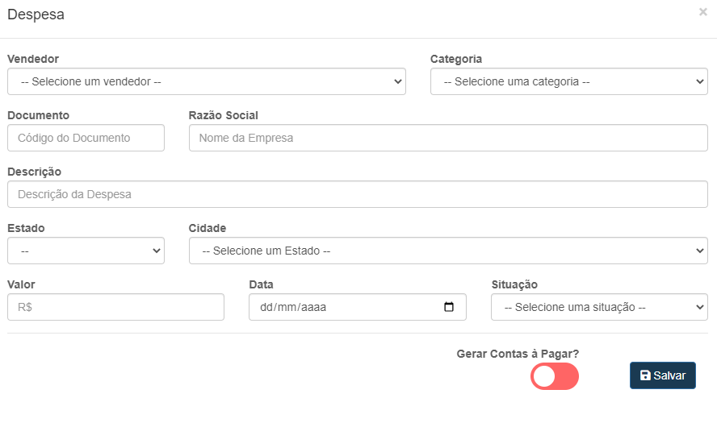

***

## Conferência de Retorno
**Campo com a função de conferir o retorno do vendedor**
***

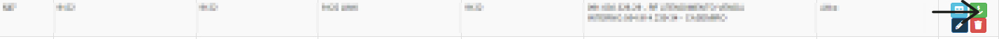

* **Selecione um Vendedor**
- **Logo após, novas Abas irão aparecer para a análise do retorno**

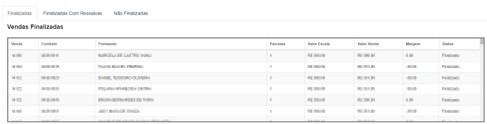

## Comissão de Vendas
**Campo visando analisar a comissão de vendas do vendedor**
***
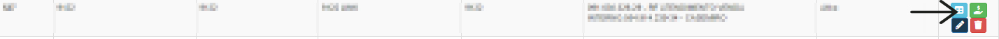

* **Selecione um Vendedor**
- **Logo após, uma nova Aba aparecerá exibindo as vendas de  certo vendedor**

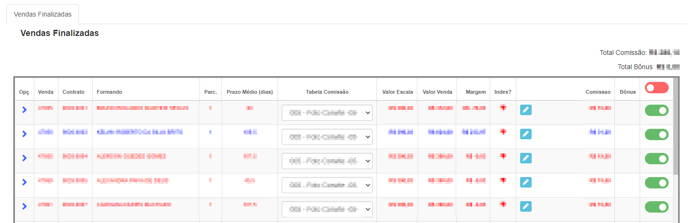
 

#### Editar Comissão

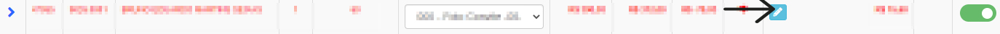

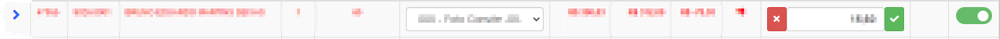