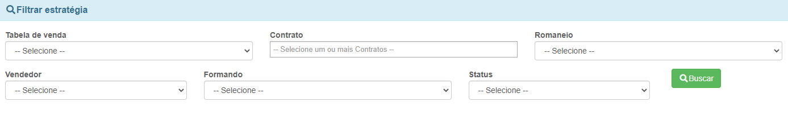
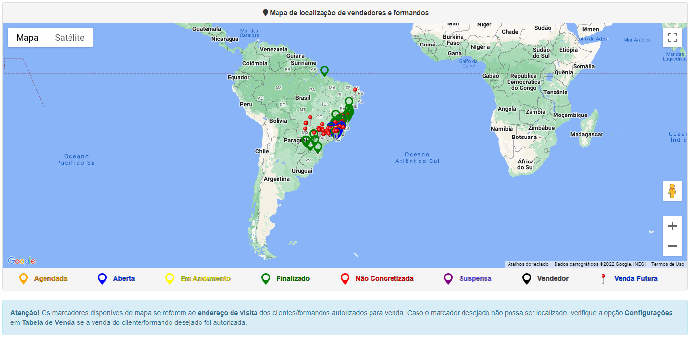

# Mapa de Vendas
**Campo com a função de facilitar a localização de um certo formando para a venda**
***

#### **Campos para pesquisa:**

* `Tabela de Venda` - Selecione uma tabela de venda
* `Contrato` - Selecione o contrato que deseja procurar
* `Romaneio` - Selecione uma Escala de vendedores
* `Vendedor` - Informe o vendedor que deseja procurar
* `Formando` - Selecione o formando que deseja saber a localização
* `Status` - Informe o Status da venda
***
1. Status de Venda
    - `Em Andamento` - Se a venda ainda está em andamento 
    - `Finalizada Com Sucesso` - A venda foi finalizada sem nenhum problema
    - `Finalizada Com Ressalvas` - A venda foi concluída com problemas
    - `Suspensa` - A venda foi suspensa por algum motivo| **Normalmente pela empresa de formatura**
    - `Não Concretizada` - A venda não foi concretizada por algum motivo
    - `Em Aberto` - A venda está aberta ocorrendo
    - `Agendada` - A venda foi agendada para ocorrer em uma data planejada

***
 

## Mapa
**O  Mapa tem a função de exibir onde é a localização dos vendedores e formandos**
***

1. Setas
    - `Laranja - Agendada` - **Tem a função de marcar no mapa vendas que estão agendadas para ocorrer**
    - `Azul - Aberta` - **A seta azul tem a função de localizar vendas em aberto**
    - `Amarela - Em Andamento` - **A seta amarela visa exibir vendas em andamento**
    - `Verde - Finalizado` - **As setas verdes tem a função de indicar vendas que já foram finalizadas**
    - `Vermelho - Não Concretizada` - **A seta vermelha tem a função de localizar vendas que não foram concretizadas**
    - `Roxa - Suspensa` - **Setas roxas tem a utilidade de exibir vendas que foram suspensa**
    - `Preto - Vendedor` - **A seta preta tem a função de marcar onde o vendedor se está localizado**
    - `Alfinete - Venda futura` - **Já o alfinete tem a função de exibir a onde serão vendas futuras**

***

* Atenção! Os Marcadores disponíveis do mapa se referem ao *endereço de visita* dos Clientes/Formandos autorizados para venda. Caso o marcador desejado não possa ser localizado, verifique a opção ***Configurações*** em ***Tabela de Vendas*** se a venda do Cliente/Formando desejado foi autorizada.