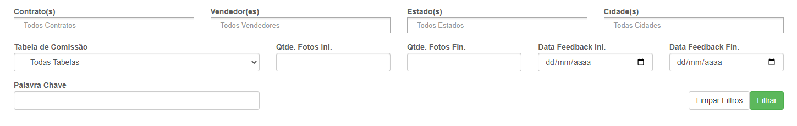
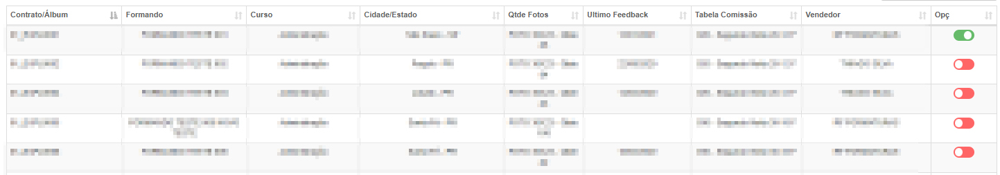
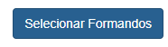
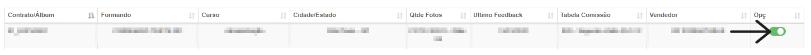
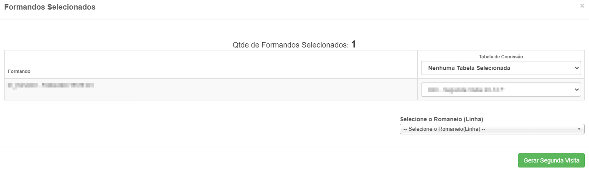

# Segunda Visita
**Campo com a função de gerenciar formandos e sua quantidades de fotos**
***

#### **Campos para filtro**:

* `Contrato` - Selecione o contrato que deseja pesquisar
* `Vendedores` - Selecione o vendedor do contrato
* `Estado` - Selecione o estado onde ocorrerá o contrato
* `Cidade` - Selecione a cidade onde ocorrerá o contrato
* `Tabela de comissão` - Informe a tabela de comssião do contrato
* `Quantidade de Fotos Mínimas` - Insira uma quantidade mínima de fotos
* `Quantidade de Fotos Máxima` - Informe a quantidade máxima de fotos
* `Data de feedback Inicial` - Insira uma data mínima para os feedbacks
* `Data de feedback Final` - Insira uma data máxima para procura por feedbacks
* `Palavra Chave` - Digite uma palavra chave para a procura do formando que deseja
 

***

 
 
***

### Selecionar Formando

* **Para que possa selecionar abrir a abá de selecionar formando,pelo menos um formando deve ter a opção ativada**

* `Selecione o Romaneio` - Selecione um romaneio para distribuição dos produtos
 

***