# Tabela de Vendas 
**Campo com a função de cadastrar e gerenciar tabelas de vendas**
***

### Nova Tabela

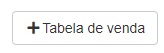

#### **Campos para preencher**:

* `Id Interno` - Insira um ID para se localizado
* `Nome` - Insira um nome para tabela
* `Contrato` - Escolha um contrato para essa tabela
* `Tipo` - Informe o tipo do contrato| **Venda Normal, Antecipada, Pós-Contrato e Vendas Virtuais**

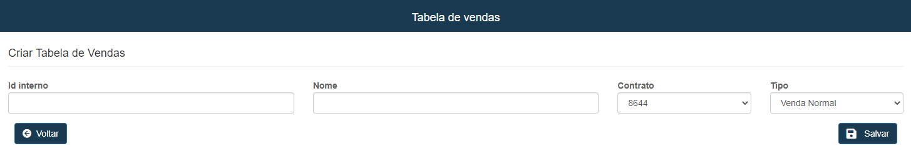

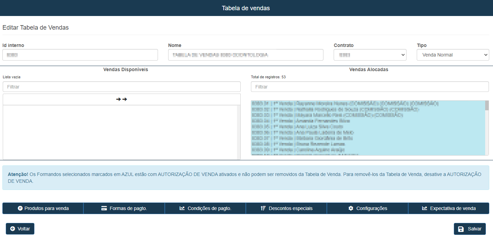
***
### Produtos para Venda
**Opção visando exibir e gerenciar ou cadastrar produtos de certo formando**
***

* **Selecione um formando**

#### Novo Produto

##### **Campos para cadastro**:

* `Pedido Extra` - Caso for um pedido extra assinale a opção
* `Produto`- Digite o produto que desejá cadastrar
* `Quantidade` - Quantidade do Produto
* `Descarte` - Informe um Número percentual para descarte| **Campo Opcional**
* `Quantidade Mínima` - Insira uma quantidade mínima para o produto
* `Valor de Venda` - Insira um valor de venda para o produto
* `Desconto` - Insira um Número em percentual para desconto| **Campo Opcional**

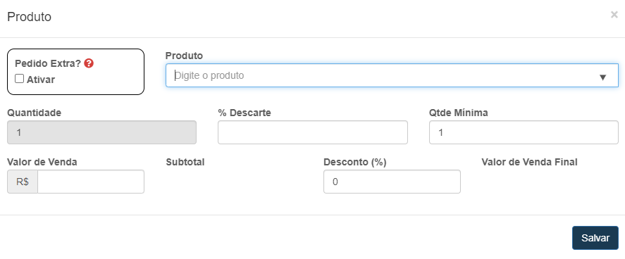

**Tabela de Produtos**
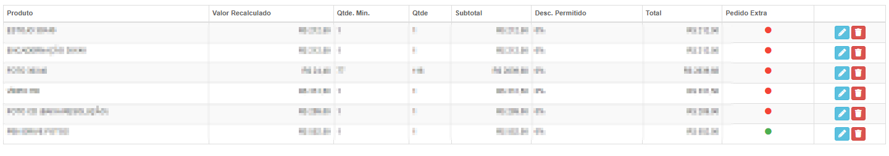
***

### Formas de Pagamento
**Opção visando gerenciar e cadastrar pagamentos para certo formando**
***

#### Nova Forma de Pagamento

##### **Campos para cadastro**:

* `Forma de Pagamento` - Selecione um meio de pagamento
* `Valor Máximo para Compra Única` - Insira um valor máximo para compra
* `Limite Máximo de escala` - Insira um limite máximo
* `Quantidade Máxima de Parcela` - Insira um Número máximo para parcelas

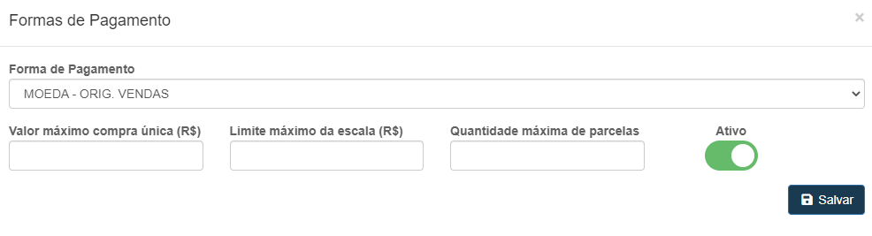

**Tabela de Pagamentos**
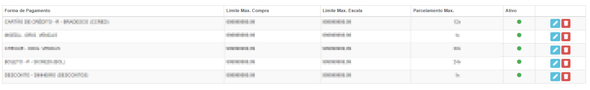
***

### Condição de Pagamento
**Campo com a função de gerenciar de cadastrar condições de pagamentos**
***

#### Nova Condição de Pagamento

##### **Campos para preencher**:

* `À Vista` - Assinale a opção caso o pagamento seja a vista
* `Condições de Pagamento` - Insira um prazo para o pagamento| **De certo mês até certo mês**
* `Margem de Juros para Venda` - Insira uma margem de juros para o pagamento
* `Carência` - Informe um Número de dias para carência do pagamento

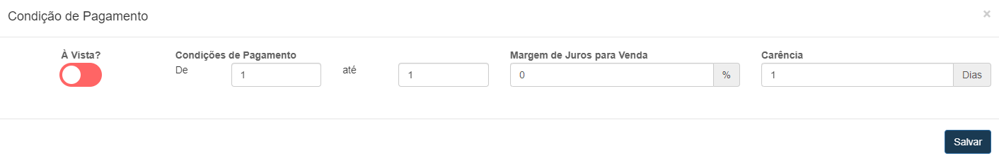

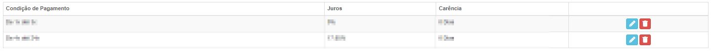

### Descontos Especiais
**Campo visando gerenciar e cadastrar descontos especiais para certo formando**
***

#### Novo Desconto

##### **Campos para cadastro**:

* `Descrição` - Dê uma descrição do desconto
* `Objeto de Desconto` - Selecione um objeto para desconto
***
1. Desconto Membros Comissão
    - `Desconto` - Insira o valor do desconto
2. Desconto produto Específico
    - `Produto Específico do Desconto` - Selecione o produto Específico para desconto
    - `Desconto` - Insira um valor para desconto
3. Desconto Valor Fixo 
    - `Desconto` - Informe um valor para desconto

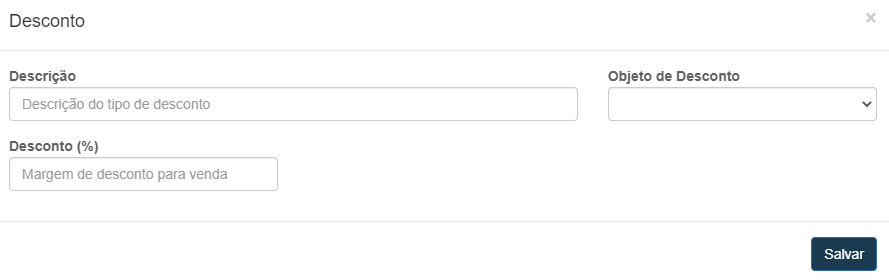

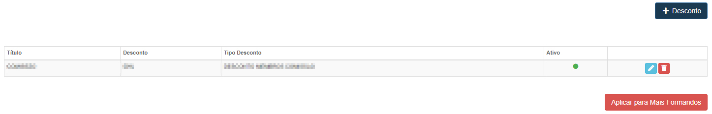
***
### Configurações
**Campo com a função de configurar descontos especiais**
***

#### **Campos**

* `Tipo de Tolerância do Limite de Desconto` - Selecione o tipo de Tolerância
* `Margem de Tolerância` - Informe um porcentual para tolerancia

***

### Expectativa de Venda
**Opção para gerenciar a expectativa de venda de certo contrato**
***

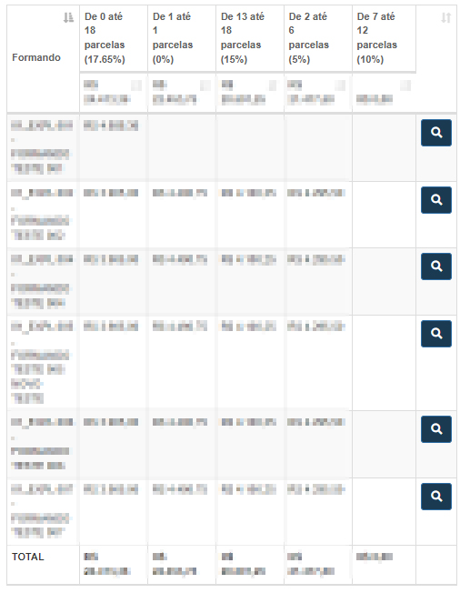

#### **Visualizar tabela de Venda**:
 
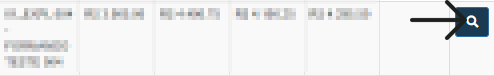

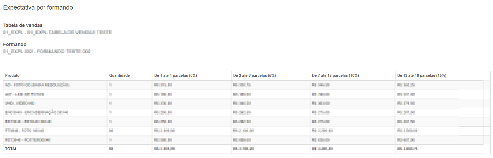

***

## Relatório de Vendas
**Opção com a função de exibir um relatório de vendas para análise**
***

#### Visualizar Relatório:
 

***

#### Relatório da Tabela de Vendas:
 
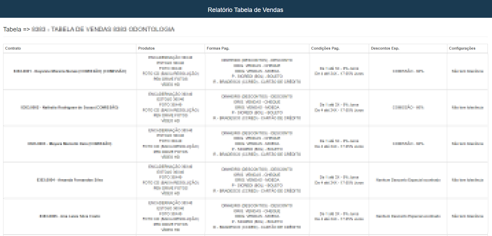