# Eventos
**Este campo tem a função de gerenciar e cadastrar eventos**
***
### Novo Evento
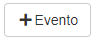

! Logo ao entrar, uma nova Aba aparecerá em sua tela    

#### **Campos para preencher**:

* `Contratos` - Selecione o contrato que deseja cadastrar o evento
    * **Após selecionar um contrato uma Aba aparecerá**
    * 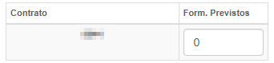
***
1. Dados do Evento
    - `Evento Base` - Selecione um evento base já cadastrado
    - `Nome do Evento` - Insira um nome para o evento
    - `Situação do Evento` - Selecione a situação do evento| **Previsto, Confirmando, Cancelado, etc.**
    - `Responsável` - Informe o responsável pelo evento
    - `Data de Solicitação` - Insira uma data para a solicitação
    - `Data/hora de início` - Informe uma data e hora para o início do evento
    - `Data/hora de Finalização` - Informe uma data e hora para a finalização do evento
    - `Liberação` - Informe a liberação do evento|  **Aprovado, Sob aprovação e Reprovado**
    - `Status` - Informe o status do evento| **Programado, Inativo, Executando, etc.**
    - `Organizador / Empresa` - Insira o nome do organizador ou da empresa que organizará o evento
    - `Contato` - Informe um meio de contato
    - `Contato da Comissão` - Insira o contato da comissão
    - `Observações` - De observações para o evento
2. Localização - **Caso tenha**
    - `Local do Evento` - Informe o local do evento
    - `Ponto de Referência` - Insira um ponto de referência para localizar
    - `CEP` - Insira o CEP do local
    - `Logradouro` - Nome da rua onde ocorrerá o evento
    - `Número` - Digite o Número de localização do local
    - `Complemento` - Insira um complemento para facilitar a localização do evento
    - `Bairro` - Insira o nome do bairro
    - `Estado` - Informe o estado onde acontecerá o evento
    - `Cidade` - Informe a cidade onde sucederá o evento
 

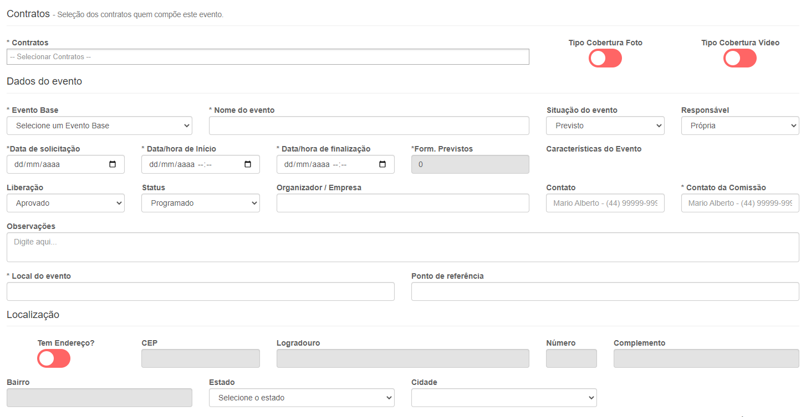
***

## Anotações
**Opção com a função de adicionar anotações para evento**
***

 

## Coberturas
**Opção com a função de gerenciar coberturas do evento**
***

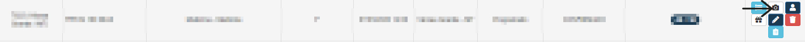

### Gerenciar coberturas
* `Objeto de Cobertura` - Selecione o tipo de cobertura
* `Quantidade Mínima` - Informe uma quantidade mínima

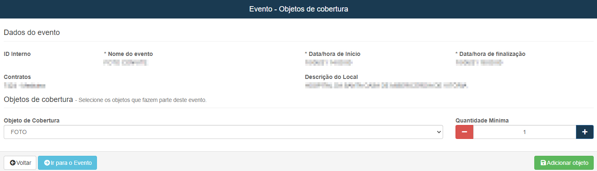
***
 

## Custos
**Campo com a função de cadastrar e gerenciar custo para o evento**
***
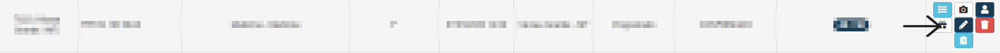

#### Novo custo

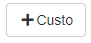

##### **Campos para preencher**:

* `Tipo de Entrega` - Escolha um tipo de entrega| **Prevista ou Nova**
* `Custo` - Selecione um tipo de custo para o evento
* `Quantidade` - Quantidade do produto
* `Custo Unitário` - Insira um custo por cada unidade
* `Custo Total` - Valor total a ser pago
* `Espécie de Pagamento` - Escolha um meio de pagamento| **Produto ou dinheiro**
* `Data Solicitação` - Insira a data de solicitação
* `Data Programada para Entrega` - Insira uma data programada para entrega dos custos
* `Conta a Pagar` - Caso a conta não foi paga assinale a opção
1. **Tipo prevista**
    - Escolha uma descrição
2. **Conta a Pagar**
    * `Data de Vencimento` - Insira uma data para o vencimento
    * `Fornecedor` - Escolha o fornecedor
    * `Conta Bancária Fornecedor` - Insira a conta bancária do fornecedor
    * `Carteira` - Selecione uma carteira para pagamento
    * `Formas de Pagamento` - Escolha um meio de pagamento
    * `Categoria` - Selecione uma categoria para forma de pagamento
     
    
    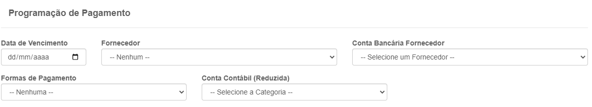

***
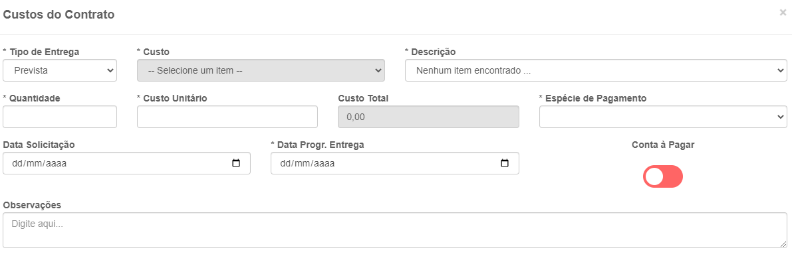

 

## Editar Evento
**Campo com a função de editar um evento já cadastrado**
***
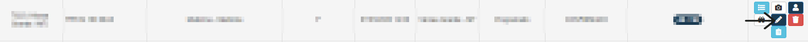
***

## Cadastro de Características:
**Campo com a função de cadastrar características  de eventos**
***

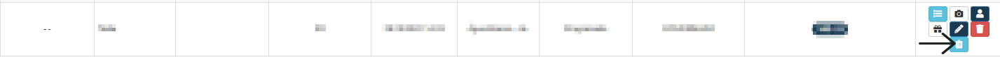

#### **Campos para preencher:**

* `Característica` - Selecione uma Característica para o evento
* `Observações` - Dê uma observação para a Característica do evento

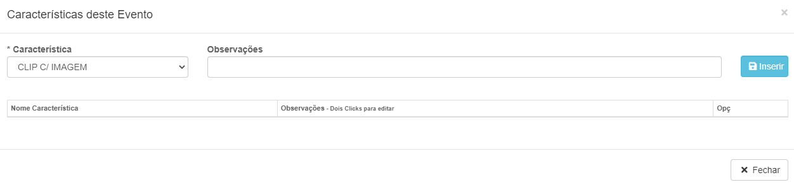