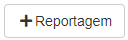

# Reportagens Externo
**Campo com a função de gerenciar reportagens além de cadastrar novas reportagens**
***

### **Nova Reportagem**

[Cadastrar Reportagem](https://rfsolutionit.github.io/myphotos/pages/gerenciamento/operacional/reportagens.html#nova-reportagem)

### **Planejamento**
**Função gerenciar planejamentos já feitos**

**Após entrar novos campos aparecerá**

##### **Visualizar Evento**

**Campo com a função de Visualizar e gerenciar informações do evento**

***

##### **Visualizar Despesa**

