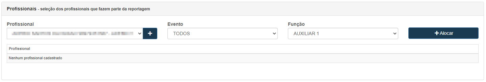
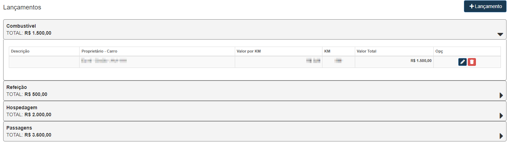
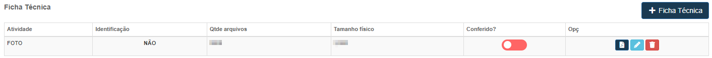

# Reportagens
**Campo com a função de gerenciar e cadastrar novas reportagens**
***

## **Nova Reportagem**

#### **Campos para preencher:**

* `Data de início` - Insira uma data de início da reportagem
* `Data de Finalização` - Informe a data de finalização da reportagem
* `Situação` - Selecione a situação da reportagem| **Em Aberto, Em Andamento , etc.**
* `Referências` - Insira um referencial para a reportagem

**Após Salvar, novas opções irão aparecer**
***
### Evento
**Campo com a função de cadastrar onde a reportagem acontecerá**
***

* `Contrato / Evento` - Selecione um evento que ocorra no mesmo dia da reportagem

**Selecione um Evento que esteja ocorrendo ao mesmo dia da reportagem**

#### Listagem de Eventos Cadastrados

***

### Profissionais
**Campo com a função de cadastrar funcionário que irão fazer parte da reportagem**
***

* `Profissional` - Selecione o profissional que participará da reportagem
* `Evento` - Selecione qual evento em que o profissional participará
* `Função` - Informe qual será a função do profissional 

#### Listagem dos Profissionais

***

## **Previsão de Reportagem**
**Campo com a função de criar uma previsão de gastos na reportagem**
***

### Nova Previsão

***

#### **Campos para cadastro:**

1. Combustível
    * `Descrição` - Dê uma descrição para a despesa
    * `Nome do Veículo` - Informe o nome do veículo que será usado
    * `Placa` - Insira a placa do veículo que será usado
    - `Proprietário` - Informe o nome do proprietário do carro que será usado para locomoção
    - `Distancia (KM)` - Insira a distância por quilômetro que provavelmente será percorrido
    - `Valor (KM)` - Insira o valor que será fasto por quilômetro
    - `Valor Total` - Valor total da despesa 
    - `Detalhes da Despesa` - Dê detalhes da despesas
2. Outros
    - `Descrição` - Dê uma descrição da despesa
    - `Quantidade` - Insira um Número de quantidade
    - `Valor Unitário` - Informe o valor por unidade desta despesa
    - `Valor Total` - Valor total da despesa
    - `Detalhes da Despesa` - Insira detalhes da despesa

#### Listagem das Despesas 

**Após criar a previsão de despesas clique em Gerar Adiantamento, uma nova Aba aparacerá com a função de escolher um responsável**

* `Selecione o Profissional` - Selecione o profissional que será responsável para receber o adiantamento
* `Forma de Pagamento` - Insira um meio de pagamento| **Moeda, Boleto, Cheque, etc.**
* `Data do Pagamento` - Informe a data que houve o pagamento
* `Conta Bancária` - Selecione uma conta bancária do responsável

***

## **Planejamento de Reportagem**
**Campo com a função principal de revisar e finalizar o planejamento**
***

### Visualizar Evento
**Campo com a função de gerência o evento** 

### Enviar Planejamento
**Este campo tem a função de enviar um link para o responsável preencher**

#### **Campos para envio**

* `E-mail` - Selecione o E-mail que deseja enviar o planejamento

####  **Campos de planejamento para preencher**

* `Check-in` - Insira a data e hora de chegadas dos funcionários
* `Check-out` - Insira a data e hora de saída dos funcionários
* `Assinado Por` - Informe quem foi o responsável que preencheu o planejamento
* `Formandos Presentes` - Valor de quantos formandos estavam presentes
***
1. Funcionários
    - `Valor Contrato` - Insira qual é o valor pago para o funcionários
    - `Acessórios` - Informe quais acessórios foram usados pelo funcionário
    - `Valor Adicional` - Valor adicional
    - `Valor Total` - Valor total 
    - `Presente` - Informe se o funcionário esteve presente no evento

#### Ficha Técnica
**Campo com função de dizer quantas fotos ou Vídeos foram feitas e o tamanho dos arquivos**
***

#### **Campos para preencher:**

* `Atividade` - Informe qual é a atividade da ficha| **Foto ou Vídeo**
* `Houve Identificação` - Caso tenha identificação insira o número de formandos
* `Quantidade de Arquivos` - Informe qual é a quantidade de fotos ou Vídeos feitas pelo funcionário
* `Tamanho Físico dos Arquivos` - Informe o tamanho em GB dos arquivos
* `Avaliação` - Dê uma avaliação para o funcionário

##### Listagem de fitas

***

### Características
**Campo com a função de verificar se foi realizado ou não cada característica do evento**
***

***
 

##### Todos os Campos

### **Despesas da Reportagem**
**Campo com a função de conferir se realmente houve as despesas ou adicionar despesas**
***

* `Status` - Informe qual é o status da despesa| **Pendente, Aprovado, Reprovado, etc.** 
* `Checkado` - Assinale a opção caso a despesa realmente aconteceu
***

#### Nova Despesa

#### **Campos para preencher:**

* `Tipo da despesa` - Insira qual é o tipo de despesa que deseja cadastrar
* `Descrição` - Dê uma descrição para a despesa
* `Data` - Insira a data da despesa
* `Valor` - Insira o valor da despesa
* `Status` - Informe qual é o status da despesa| **Pendente, Aprovada, Reprovada, etc.**
* `Estado` - Insira um Estado
* `Cidade` - Selecione uma cidade

***

### **Resumo**
**Campo com a função de gerenciar os gastos da reportagem**
***

***

### **Finalizar Reportagem**
**Após todo o planejamento ser preenchido e analisado você deve finalizar a reportagem**
***

* `Valor da Reportagem` - Valor dos gastos da reportagem como brindes e com os funcionários
* `Valor das Despesas` - Valor gasto com o adiantamento
* `Valor Adiantado Fora da Reportagem` - Valor extra adiantado fora da reportagem por algum motivo
* `Custo da Reportagem` - Valor total das somas de todos os produtos

**Após clicar em finalizar, uma nova Aba aparecerá. Após selecionar o recebedor novos campos surgirá**

* `Selecione o Recebedor` - Selecione o recebedor
* `CPF / CNPJ` - Número do CPF ou CNPJ do Recebedor
* `Cidade` - Cidade do Recebedor
* `Saldo da Conta Anterior` - Saldo da conta antes da reportagem
* `Saldo da Conta Recalculado` - Saldo da conta após a reportagem
* `Lançamento na Conta Corrente` - Assinale a opção para a conta ser lançada
* `Forma de Pagamento` - Insira o meio de pagamento
* `Data Pagamento` - Insira data de pagamento

***

## **Despesas de Reportagem**
**Campo com a função de gerenciar as despesas e caso seja preciso adicionar novas despesas fora da Reportagem**
***

### **Nova Despesa**

#### **Campos para preencher**

* `Tipo de Despesa` - Selecione o tipo da despesa que deseja cadastrar  
* `Status` - Informe qual é o status da despesa
* `Número de Registro` - Insira o número de registro
* `Razão Social` - Insira a Razão Social da pessoa responsável da empresa| **Nome Formal**
* `CPF / CNPJ` - Informe o número do documento
* `Descrição` - Dê uma descrição para a despesa
* `Estado` - Insira um Estado
* `Cidade` - Selecione uma Cidade
* `Data da Despesa` - Insira a data da despesa
* `Valor` - Insira o valor da despesa
***
1. Responsabilidade
    - `Evento` - Selecione para qual evento esta despesa pertence
    - `Contrato` - Insira qual contrato essa despesa pertence
    - `Profissional` -Informe qual é o responsável desta despesa
2. Conta a Pagar
    - `Data de Vencimento` - Insira a data de vencimento
    - `Fornecedor` - Informe o fornecedor da conta
    - `Conta Bancária do Fornecedor` - Informe a conta bancária do fornecedor
    - `Formas de Pagamento` - Insira o meio de pagamento da despesa
    - `Conta Contábil (Reduzida)` - Informe qual é o tipo de gasto da conta
    - `Centro de Custo` - Informe qual é o centro de custo

***
 

#### **Listagem de Despesas**
