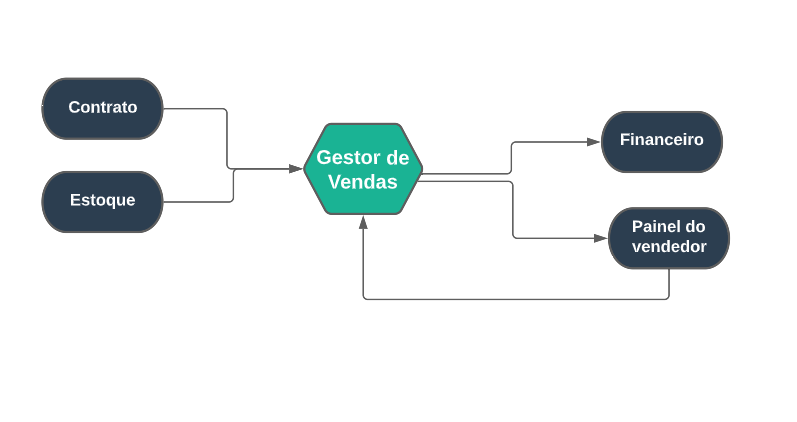

## Gestor de Vendas
***
 

##### **Definições**

O Módulo gestor de vendas está ligado diretamente com o painel do vendedor, também é ligado com o 
financeiro 

No Modulo você pode cadastrar vendedores e tabela de comissões para as vendas, além de gerenciar
pedidos extras, a comissões de vendedores, o mapa de vendas, a tabela de vendas e criar uma escala
de vendedores

Também você pode ter um relatório sobre os pedidos extras, feedbacks de vendas, um relatório sobre
os produtos, listagem de vendas e análise sobre as vendas

##### **Características**

* Permite cadastrar vendedores para a venda de produtos
* Permite cadastrar uma tabela de comissões para vendedores 
* Permite também gerenciar pedidos que são extras
* Permite gerenciar o mapa das vendas
* Permite cadastrar uma tabela para as vendas
* Permite cadastrar e gerenciar escala de vendedores
* Permite ter um relatório dos pedidos extras
* Permite obter um relatório sobre todos o pedidos
* Permite uma listagem das vendas
* Permite realizar uma análise das vendas

##### **Visão Geral**

O Campo de cadastro de comissões do módulo de gestor de vendas tem a função de criar uma tabela de comissões
para as vendas de produtos, mas precisa-se cadastrar um vendedor

Um vendedor também pode ser um fornecedor como um profissional ou até mesmo um representante

Entre no campo do [Vendedor](https://rfsolutionit.github.io/myphotos/pages/vendedor/vendedor.html) preencha todos os campos para cadastrar um novo vendedor, após o cadastro de
um vendedor você deve cadastrar uma conta do vendedor para o painel do vendedor 

No Campo de gerenciamento você pode analisar pedidos, tabela de vendas e criar uma escala para vendedores

Para criar uma escalada de vendedor basta entrar no campo e cadastrar uma nova escala, esse campo tem a função
de dar ao vendedor uma função, onde ele trabalhará e com que o vendedor trabalhará, basta selecionar um vendedor 
cadastrado e alocar formandos para as vendas

Você pode entrar no campo de tabela de vendas para alocar formandos para uma venda, basta criar uma tabela,
escolher um contrato que as vendas ainda não ocorreram e selecionar os formandos que queira alocar para as
vendas

Após a venda iniciar existe um campo chamado mapa de vendas onde você pode analisar como está ocorrendo as vendas
e também onde já ocorreu, neste campo pode mostrar as vendas que estão agendadas, suspensa, vendas futuras em andamento,
finalizadas, etc.

Na área do relatório você pode analisar as vendas, ter um relatório sobre os produtos, uma listagem sobre vendas,
um relatório sobre os feedbacks, etc.

