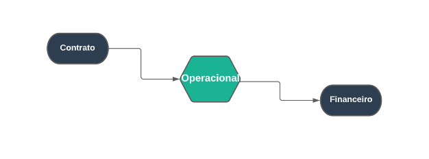

## Operacional
***
 

##### **Definições**

O Modulo operacional permite o cadastro de profissionais e seu equipamentos, além de permitir o gerenciamento de 
eventos e reportagens, e também um relatório de pagamentos e reportagens 

O Campo dos [Profissionais](https://rfsolutionit.github.io/myphotos/pages/cadastro/operacional/profissionais.html) estão ligado diretamento com as reportagens, neste campo você cadastra profissionais 
para trabalho e eventos de reportagens, basta apenas preencher os campos com dados do profissional

Além disso exite a opção de cadastrar acessórios para o profissional para que possa ser usandos em eventos

Já a area de [eventos](https://rfsolutionit.github.io/myphotos/pages/gerenciamento/operacional/eventos.html) tem a função de cadastrar novos eventos para a reportagem, onde será localizado e quem 
comparecerá no evnto, alem disso é permitido cadastrar caracteristicas para o evento e custos

O Modulo de [Reportagens](https://rfsolutionit.github.io/myphotos/pages/gerenciamento/operacional/reportagens.html) tem a função de definir o papel do profissional em certo eventos especifico 

O Modulo operacional depende dos contratos para ocorrer além de ter uma ligação com o financeiro

##### **Caracteristicas**

* Permite que possa cadastra profissionais
* Permite cadastrar acessórios para trabalho
* Permite criar eventos
* Permite cadastrar reportagens 
* Também previsões e finalizar reportagens
* Além de permitir relatório de reportagens e programação de pagamento

##### **Visão Geral**

Comece cadastrando acessórios para o profissional, logo cadastre um evento base, após isso cadastre
caracteristicas para eventos e finalmente cadastrando o profissional, seguindo esse caminho fica mais
facíl para prosseguir

O Modulo do profissional é totalmento ligado com os evntos e reportagens

Para cadastrar reportagens precisa-se de eventos e profissionais cadastrados, com esses campos cadastrados 
basta cadastrar uma reportagem

Após ter uma reportagem cadastrada possa realizar uma previsão para a reportagem

Este campo tem a função de fazer uma previsão de quanto será gasto na viagem para a reportagem, como 
gastos com combustiveis, alimentos ou hospedagem, após a criação da previsão o profissional principal 
cadastrado na criação da reportagem, o dinheiro da previsão será entregue para ele

Após o acontecimento da reportagem o planejamento deve ser feito, o planejamento é o campo que 
tem a função de cadastrar como foi o evento e como foi realizado o trabalho do profissional

Agora Só resta finaliza a reportagme

