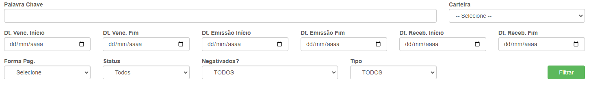
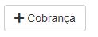
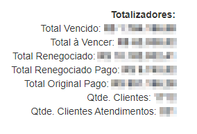
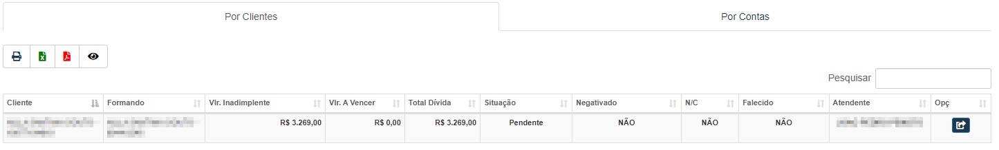
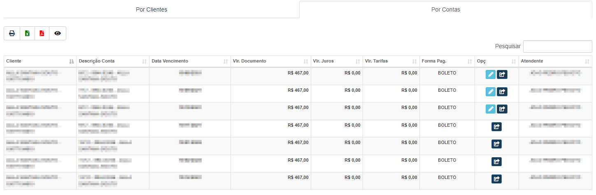

# Ambiente de Cobrança
**Campo do cobrador, funciona como o campo de clientes para cobranças, mas apenas para o cobrador**

#### **Campos para pesquisa**

* `palavra-chave` - Insira uma Palavra-chave para facilitar a procura da conta
* `Carteira` - Selecione a carteira da conta que deseja procurar
* `Data de Vencimento Inicial` - Informe uma data mínima do vencimento das contas para a procura
* `Data de Vencimento Final` - Informe a data máxima do vencimento das contas
* `Data de Emissão Inicial` - Insira uma data mínima de emissão das contas
* `Data de Emissão Final` - Insira a data máxima de emissão das contas que deseja procurar
* `Data de Recebimento Inicial` - Selecione uma data mínima dos recebimentos das contas
* `Data de Recebimento Final` - Selecione a data máxima de recebimentos das contas
* `Forma de Pagamento` - Informe a forma de pagamento da conta que deseja procurar
* `Status` - Informe o status da conta que procura
* `Negativados` - Informe se é negativado| **Sim ou Não**
* `Tipo` - Selecione o tipo da conta| **Renegociados ou Originais**

### **Nova Cobrança**
**Este campo tem a função de criar uma cobrança em uma conta aleatória**
***

* **Após clicar você será redirecionado para uma nova aba de um cliente aleatório**

[Realizar Cobrança](https://rfsolutionit.github.io/myphotos/pages/outros/clientes-cbran.html#cobranca)
___

#### Totalizadores

* `Total Vencido` - Valor total das contas que já você trabalhou
* `Total a Vencer` - Valor total a vencer
* `Total Renegociado` - Valor total das contas que você trabalhou sendo renegociado
* `Total Renegociado Pago` - Valor total das contas que você trabalhou sendo renegociado e pago
* `Total Original Pago` - Valor total das contas originais que foram trabalhas 
* `Quantidade de Clientes` - Quantidade de clientes que você trabalhou
* `Quantidade de Clientes Atendidos` - Quantidade de clientes atendidos que você trabalhou
***

### **Listagem por Clientes**

**Tem a função de listar apenas os clientes**
***
### **Listagem Por Contas**

**Tem a função de listar as contas dos clientes**