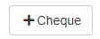
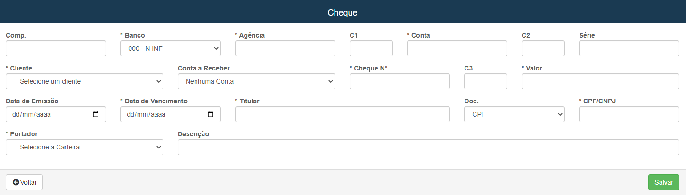
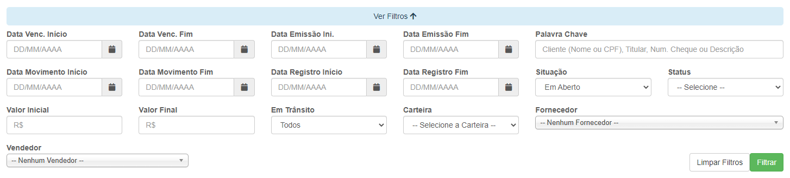

# Cheques
**Campo com a função de cadastrar e gerenciar cheques**
***

### Novo Cheque

#### **Campos para cadastro :**

* `Compensação` - Insira o código que identifica o banco de compensação
* `Banco` - Selecione qual banco pertence o titular do cheque
* `Agência` - Informe o número da agência
* `C1` - Insira o digito verificador correspondente ao tipo da conta
* `Conta` - Informe o número da conta
* `C2` - Insira o digito verificador correspondente a série do cheque
* `Série` - Informe o número de série do cheque
* `Cliente` - Selecione um cliente que deseja fazer o cheque
* `Conta a Receber` - Informe qual conta receberá o cheque
* `Cheque Número` - Insira o número do cheque
* `C3` - Insira o digito verificador do cheque
* `Valor` - Informe o valor do cheque
* `Data de Emissão` - Informe a data de emissão do cheque
* `Data de Vencimento` - Informe a data de vencimento do cheque
* `Titular` - Insira o titular do cheque
* `Documento` - Informe o tipo do documento do titular do cheque
* `CPF/CNPJ` - Insira o número do documento do titular
* `Portador` - Selecione uma carteira 
* `Descrição` - Dê uma descrição do cheque

## Pesquisa de Cheques
**Função de encontrar os cheques que deseja**
***

#### **Campos para preencher :**

1. Data
    * `Data Vencimento Inicial` - Informe uma data de vencimento mínima
    * `Data Vencimento Final` - Insira uma data máxima para o vencimento do cheque que deseja procurar
    * `Data Emissão Inicial` - Insira uma data mínima para a emissão do cheque que deseja procurar
    * `Data Emissão Final` - Insira a data de emissão máxima dos cheques
    * `Data Movimento Inicial` - Informe uma data mínima para a ocorrência de movimento para o cheques 
    * `Data Movimento Final` - Informe uma data máxima para os movimentos dos cheques
    * `Data Registro Inicial` - Insira uma data mínima para registro dos cheques
    * `Data Registro Final` - Informe uma data máxima para os registros dos cheques
2. Outros Campos
    - `palavra-chave` - Informe uma palavra-chave para a facilitação da procura de um cheque
    - `Situação` - Informe a situação do cheque que deseja procurar| **Todos, Em Aberto e Recebidos/Pagos**
    - `Status` - Selecione o status do cheque
    - `Valor Inicial` - Informe um valor mínimo para a pesquisa dos cheques
    - `Valor Final` - Insira um valor máximo para a procura dos cheques
    - `Em Trânsito` - Informe se está em transito| **Sim ou Não**
    - `Carteira` - Informe a carteira do cheque
    - `Fornecedor` - Selecione um fornecedor dos cheques que procura
    - `Vendedor` - Informe um vendedor

