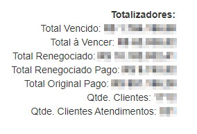
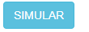
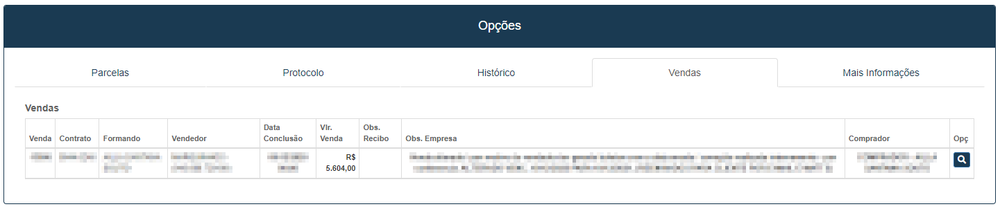

# Renegociação de Contas
**Campo com a principal função de renegociação das contas**
***

#### **Campos para filtros:**

* `palavra-chave` - Insira uma palavra-chave para facilitar a procura
* `Carteira` - Informe uma carteira
* `Data Vencimento início` Insira uma data mínima de vencimentos
* `Data Vencimento Final` - Insira uma data máxima de vencimentos
* `Data de Emissão Início` - Informe uma data mínima das emissões
* `Data de Emissão Final` - Informe a data máxima de emissões
* `Data de Recebimento início` - Selecione uma data mínima de recebimentos
* `Data de Recebimento Final` - Selecione uma data máxima de recebimentos
* `Situação` - Informe a situação da cobrança| **Pendente, Cliente não Retornou, etc.**
* `Negativos` - Informe se deseja buscar negativados| **Sim ou Não**
* `Tipo` - Selecione o tipo da cobrança| **Original ou Renegociadas**
***
1. Configuração de Renegociação

    

    - `Formas de Pagamento` Insira o meio de pagamentos das cobranças
    - `Carteira` - Informe as carteiras que deseja procurar
    - `Dias Vencimento` - Insira a quantidade de dias para o vencimento

___
#### **Totalizadores**

 

* `Total Vencido` - Valor total de pagamentos vencidos
* `Total a Vencer` - Valor que ainda não passou do vencimento
* `Total Renegociado` - Valor total de renegociações
* `Total Renegociado Pago:` - Valor total de renegociações já pago
* `Total Original Pago` - Valor total pago sem renegociações
* `Quantidade de Clientes` - Quantidade de clientes
* `Quantidade de Clientes Atendidos` - Quantidade de clientes já atendidos
___

## **Listagem de Cobranças por Clientes:**

* **Campos que estando em vermelho já estão negativados**
***

## **Listagem de Cobrança por Contas**

* **As duas tabelas tem a mesma função a única diferença é o meio de busca**
***

## **Cobrança**:
***

**Após clicar você será redirecionado par uma nova aba com informações da cobrança**

* `Negativado` - Informe se a cobrança está negativado
* `Falecido` - Assinale essa opção caso o cliente faleça
* `Não Consta` - Assinale caso o cliente não consta
* `Situação` - Informe qual é a situação do cliente| **Cliente não atende, cliente não retornou, etc.**
***

1. Contato
    - **Caso queira adicionar um contato extra**
    - `Contato` Insira o contato que deseja adicionar| **Número de Telefone, E-mail, etc.**
    - `Chat` - Caso for número esta opção será ativada
***

* **Logo abaixo tem outras abas**

## **Parcelas**
**Função de gerenciar parcelas e criar renegociações**

**Contas a Receber Originais**

* `Saldo Vencido` - Valor total das contas que não foram pagas
* `Saldo Corrigido` - Saldo dos pagamentos vencidos com a correção com juros
* `Saldo a Vencer` - Saldo que o pagamento ainda não venceu
* `Total Pendente` - Valor a ser pago
* `Saldo Quitado` - Valor pago

**Contas a Receber Negociadas**

* **Após uma nova proposta for aprovada, novos pagamentos irão aparecer aqui**

**Contas Recebidas**

***

### **Renegociar**

#### **Campos para preencher:**

* `Valor da Parcelas` - Valor total das parcelas escolhidas
* `Tarifa` - Insira um valor de tarifa
* `Valor Recalculado` - Valor recalculado com o valor das tarifas
* `Parcelas` - Insira um Número de parcelas
* `Juros` - Insira o valor de juros
* `Valor por Parcela` - Valor atual das parcelas
* `Valor Atualizado` - Valor total atualizado
***
1. Entrada
    - **Assinale a opção caso tenha uma entrada**
    - `Valor Entrada` - Insira o valor da entrada
    - `Data Entrada` - Informe a data da entrada
    - `Valor à Parcelar` - Valor total a pagar menos o valor de entrada
2. Simular

    

    - **Opção para o cliente analisar a proposta e concluir se vale a pena**
    - `Data` - Insira uma data para o pagamento das parcelas
    - `Valor` - Valor de cada parcela
    - `Carteira de Recebimento` - Carteira de recebimento das parcelas
    - `Protocolo` - Código criado para o cliente verificar qual é sua proposta

***

### **Propostas Anteriores**
**Após salvar uma proposta ela ficará salva nesta opção**
***

**Para aprovar uma proposta basta apenas ir em editar e efetivar proposta**
***

**Parcelas que estão amarelas são aquelas que sofreram renegociação**
***

[Realizar o Pagamento|](https://rfsolutionit.github.io/myphotos/pages/outros/receber.html#recebimento-de-conta)
**O processo de realizar pagamento é o mesmo de recebimento de conta**
***

### **Quebrar Contrato**

**Após clicar uma nova aba aparecerá para confirmar se realmente quer quebrar o contrato**

**Depois da quebra do contato as contas antigas negociadas e não foram pagas continuarão em amarelo, mas agora estão ativas, já as contas criadas da renegociação serão apagadas**

***

## **Protocolo**
**Campo com a função de criar protocolos para o atendimento com o cliente**
***

### **Novo Protocolo**

**Após criar um novo protocolo você tem a opção de criar novos registro**
***
#### **Registros**

#### **Campos para preencher :**

* `Data / Hora` - Data e hora do registro
* `Contato` - Insira o nome do contato
* `Assunto` - Informe o assunto do registro
* `Detalhamento` - Insira detalhes do registro
* `Definir Lembrete` - Definir uma data para lembrete

***

#### **Listagem de Protocolos**
 

***

## **Histórico**
**Campo com a função de gerenciar o histórico de acontecimentos desta conta**
***

***

## **Vendas**
**Campo com a função de gerenciar a venda que gerou as parcelas**

* **A opção da lupa tem a função de visualizar a venda**
***

## **Mais Informações**
**Campo com a função de gerenciar outras informações**

