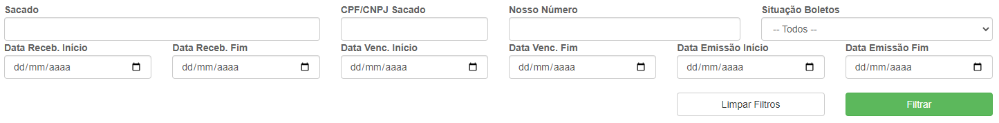
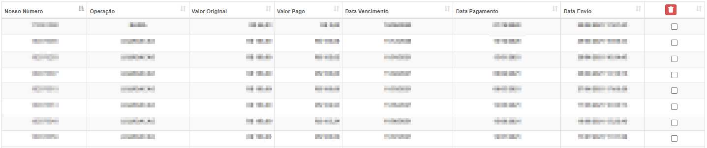

# Cobrança Bancária
**Campo com a função de gerenciar boletos de certa conta**
***

#### **Campos para pesquisa :**

* `Sacado` - Insira um nome
* `CPF/CNPJ Sacado` - Insira o número do CPF ou CNPJ
* `Nosso Número` - Insira o número do boleto que deseja procurar
* `Situação dos Boletos` - Informe a situação do boleto| **Rejeitados, Emitidos, etc.** 
***
1. Datas
    * `Data de Recebimento Inicial` - Insira uma data mínima de recebimentos
    * `Data de Recebimento Final` - Insira uma data máxima de recebimentos
    * `Data de Vencimento início` - Informe uma data mínima de vencimento para a pesquisa
    * `Data de Vencimento Fim` - Informe uma data máxima de vencimento
    * `Data de Emissão Inicial` - Selecione a data mínima de emissão
    * `Data de Emissão Final` - Selecione a data máxima de emissão

***

### **Listagem**
 
