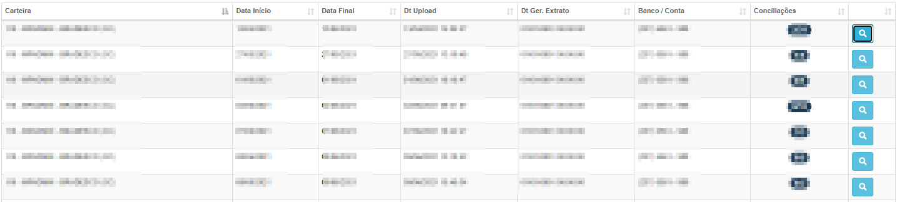
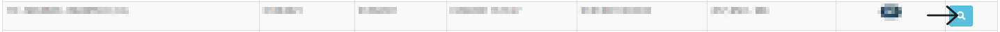
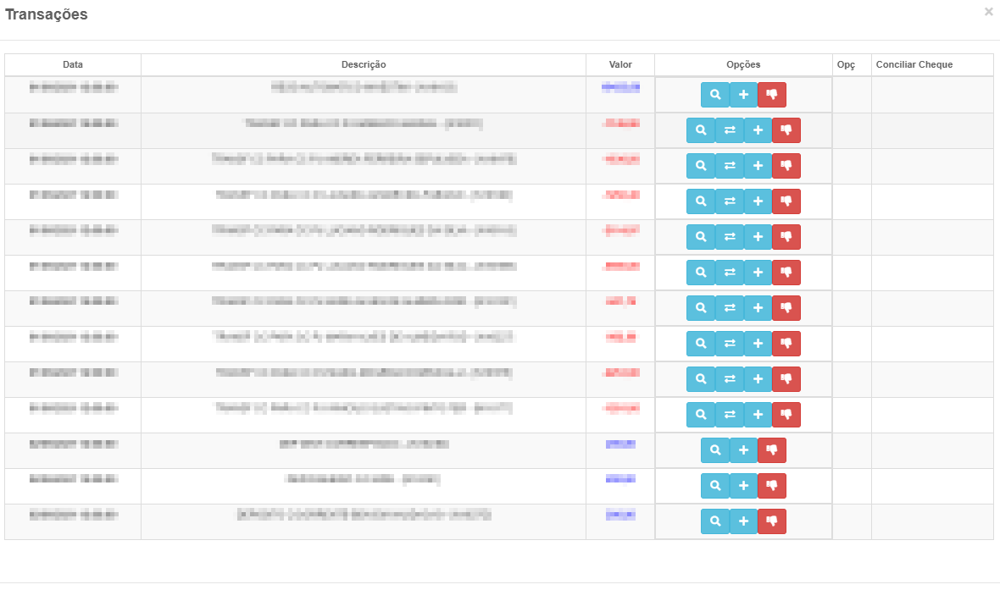
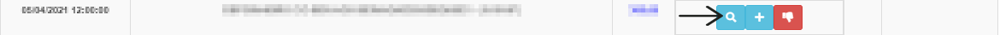
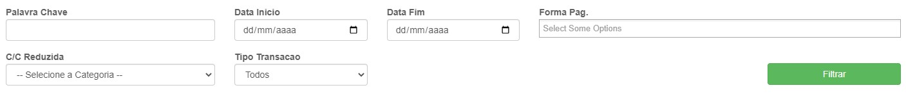
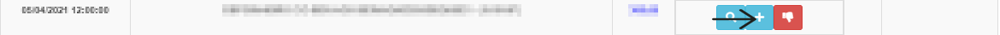
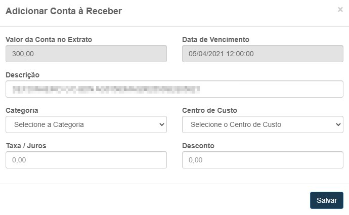
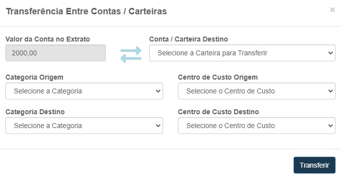

# Extratos Bancários
**Campo com a função de gerenciar e Visualizar transações de extratos bancários**
***
### **Exemplo de listagem de extratos cadastrados:**
 

**Informações de campos**

* `Carteira` - Nome da carteira
* `Data início` - Data de criação
* `Data Final` - Data Final
* `Data Upload` - Data de upload da carteira
* `Data Ger. Extrato` - Data de gerada do extrato
* `Banco / Conta` - Banco ou conta
* `Conciliação` - Número de conciliações

### **Visualizar Extrato :**

#### **Visualizar Despesas**

##### **Filtros de Pesquisa**

* `palavra-chave` - Insira uma palavra-chave para a pesquisa
* `Data início` - Insira uma data mínima para a pesquisa 
* `Data Fim` - Informe uma data máxima para a pesquisa
* `Forma de Pagamento` - Informe o meio de pagamento
* `Conta Contábil (Reduzida)` - Selecione o tipo de gasto
* `Tipo Transação` - Selecione o tipo de transação| **Crédito e Débito**

**Campo visando mostra as despesas e as receitas da conta**
***

#### **Adicionar Conta A Receber**

##### **Campos para Preencher**

* `Valor da Conta no Extrato` - Valor da conta
* `Data de Vencimento` - Data de Vencimento de extrato
* `Descrição` - Dê uma descrição para a conta
* `Categoria` - Selecione o tipo de gasto
* `Centro de Custo` - Informe o centro de custo
* `Taxa / Juros` - Insira uma taxa de juros
* `Desconto` - Insira um valor para desconto| **Caso Precise**

***

#### **Transferência Entre Contas / Carteiras**

##### **Campos para Preencher**

* `Valor da Conta no Extrato` - Valor da Conta no Extrato
* `Conta / Carteira Destino` - Selecione a conta que ocorrerá a transferência
* `Categoria Origem` - Informe o tipo de custo de origem
* `Centro de Custo Origem` - Informe o centro de custo de origem
* `Categoria Destino` - Insira um novo tipo de custo
* `Centro de Custo Destino` - Insira o novo centro de custo 

