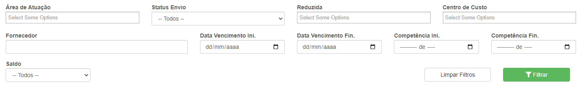
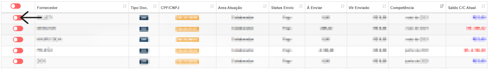
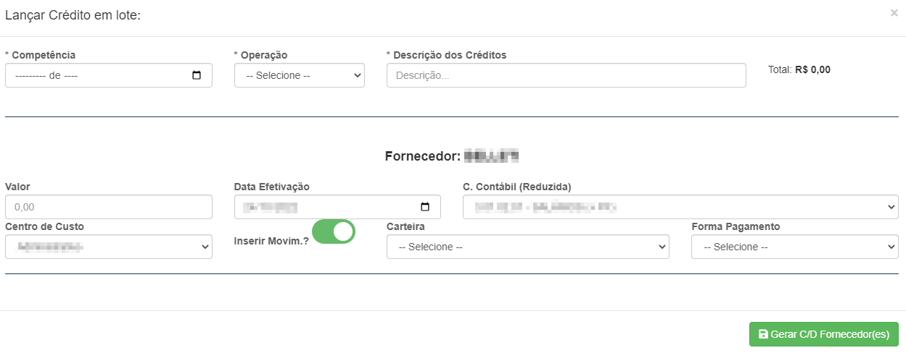

# Folha de Pagamento
**Campo com a função de gerenciar a folha de pagamentos e lançar créditos para o fornecedor**
***

#### **Campos para Pesquisa :**

* `Área de Atuação` - Informe a área de atuação do fornecedor que deseja procurar| **Fornecedor, Vendedor, etc.**
* `Status Envio` - Informe o status de envio do fornecedor que deseja procurar
* `Reduzida` - Selecione o tipo de custo do fornecedor
* `Centro de Custo` - Selecione um centro de custo do fornecedor que procura
* `Fornecedor` - Selecione o fornecedor que deseja procurar
* `Data de Vencimento Inicial` - Informe uma data mínima de vencimento do pagamento que deseja procurar
* `Data de Vencimento Final` -Insira uma data máxima de vencimento do pagamento que deseja procurar
* `Competência Inicial` - Insira uma data de Competência mínima
* `Competência Final` - Insira uma data de Competência máxima
* `Saldo` - Selecione o tipo de saldo| **Todos, Positivo ou Negativo**

***

## Lançar Crédito
**Selecione um fornecedor e vá em Lançar Crédito Em Lote**
***

#### **Campos para envio:**

* `Competência` - Insira uma data para a Competência 
* `Operação` - Selecione um meio da operação| **Débito ou Crédito**
* `Descrição dos Créditos` - Dê uma descrição para o lançamento do crédito
* `Total` - Total a ser pago
***
1. Fornecedor
    - `Valor` - Insira um valor do crédito a ser lançado para certo fornecedor
    - `Data de Efetivação`  - Informe a data de efetivação do lançamento do crédito
    - `Conta Contábil` - Informe o tipo de gasto do fornecedor
    * `Centro de Custo` - Selecione o centro de custo do fornecedor
    - `Inserir Movimento` -Informe se a movimento
2. Inserir Movimento
    - `Carteira` - Selecione uma carteira
    - `Forma de Pagamento` - Informe um meio de pagamento

